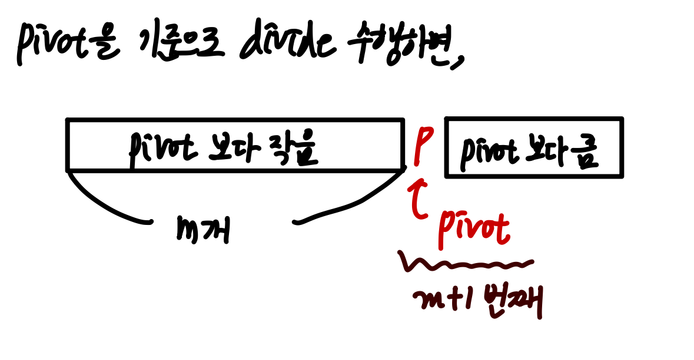
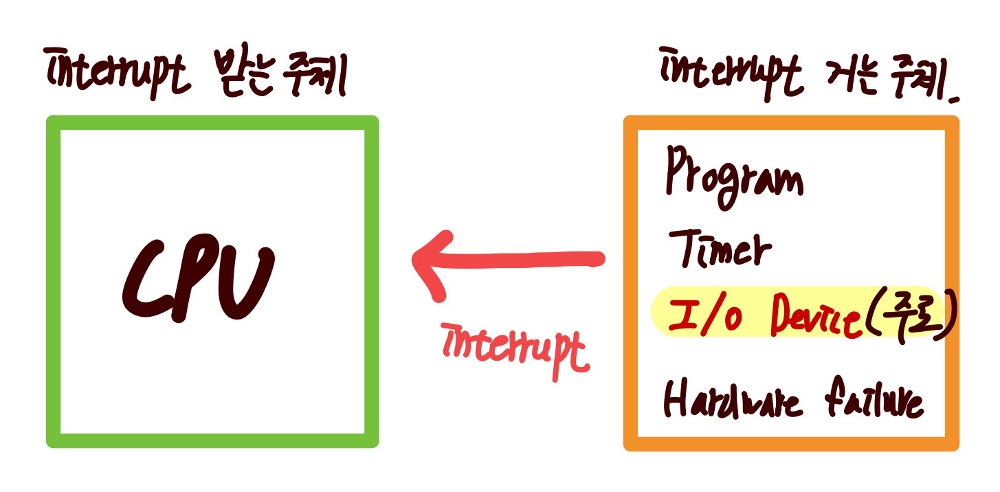
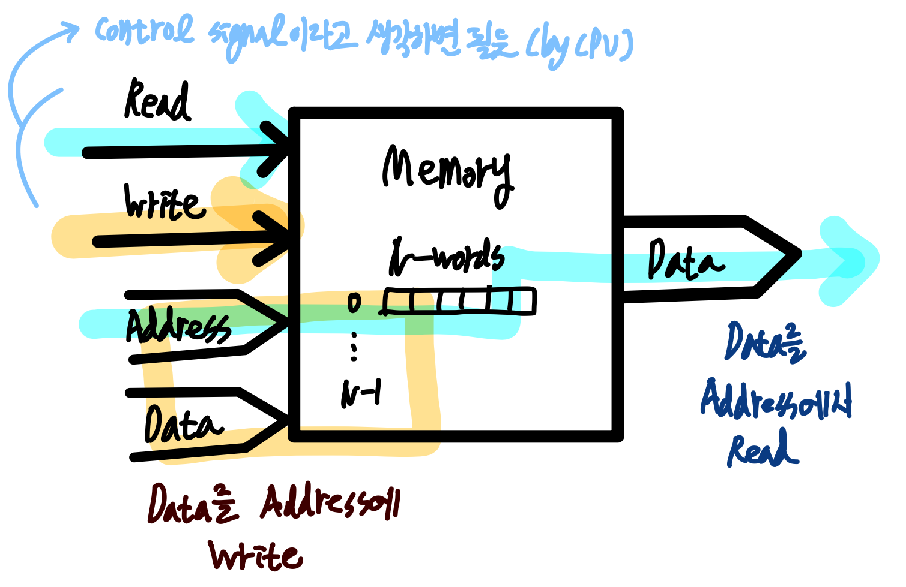
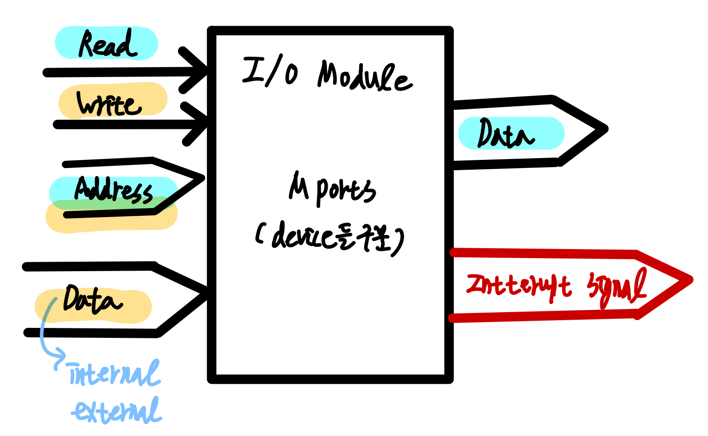
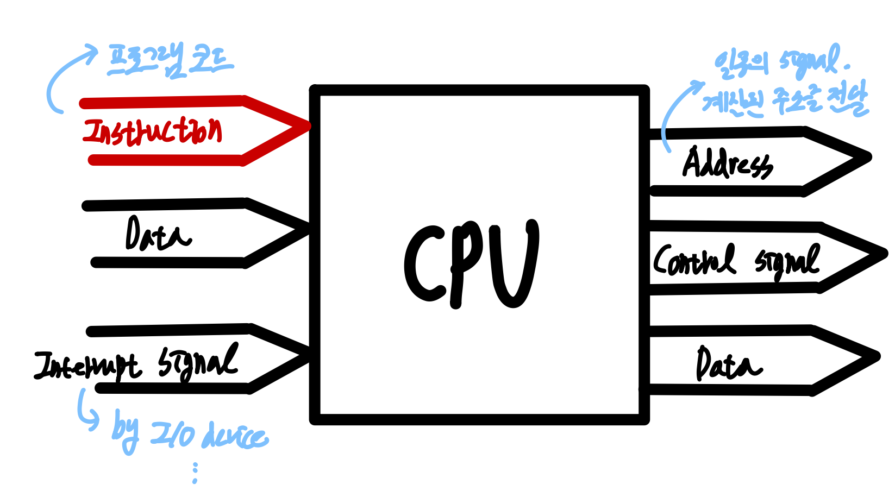

## Highlight

- 분할 정복
  - 분할 정복 응용 (이분 탐색, k-th 원소 구하기)
- CPU와 I/O 간의 interrupt 동작과 그에 따른 Program Counter의 동작
- 들어오고 나가는 화살표에 따른 CPU, Memory, I/O module의 추상화

<br>

## 전공 수업

### 컴퓨터 알고리즘

**분할 정복**

- **분할 정복**을 이용하는 알고리즘 구조 : 1. 분할 (divide) 2. 정복 (conquer) 3. 통합 (merge, 이 과정은 문제에 따라 달라질 수도 있다.)
- **분할 정복**을 이용하여 **`k`번째 원소 구하기**
  

  - `k`번째 원소라는 뜻은, 정렬 하였을 때 자신의 앞의 원소가 `k-1`개 있다는 걸 의미함.
  - 따라서, pivot을 통하여 분할 과정을 거치면, pivot 기준으로 왼쪽에는 pivot 보다 작은 애들, 오른 쪽에는 pivot보다 큰 애들이 오게 된다.
  - 이를 통해, **바로 원소들을 정렬하였을 때, `pivot`이 앞에서 부터 몇 번째에 위치하는 지 알 수 있다.**
  - 구현 코드

    ```javascript
    // ref: https://modoocode.com/287

    // 분할 정복을 통하여 k 번째 원소를 찾기
    // Quick sort 를 응용한다.

    const partition = (data, start, end, pivotPos) => {
      const pivot = data[pivotPos]
      let currentSmallLoc = start // pivot 보다 작은 원소의 위치 (이 인덱스가 크기 순임은 보장하지 않음)

      for (let i = start; i <= end; i++) {
        if (data[i] <= pivot) {
          // pivot보다 작은 원소를 pivot 앞 쪽으로 옮긴다.
          ;[data[i], data[currentSmallLoc]] = [data[currentSmallLoc], data[i]]
          currentSmallLoc++
        }
      }

      return currentSmallLoc - 1
    }

    const quickSelect = (data, start, end, k) => {
      if (start === end) {
        return data[start]
      }

      const pivotPos = end

      // 파티션 후, pivot의 위치를 반환받는다.
      const pivotNewPos = partition(data, start, end, pivotPos)

      if (pivotNewPos === k) {
        return data[pivotNewPos]
      } else if (pivotNewPos > k) {
        // 찾는 원소가 pivot 왼쪽에 있는 경우 왼쪽 부분을 탐색한다.
        return quickSelect(data, start, pivotNewPos - 1, k)
      } else {
        // 찾는 원소가 pivot 왼쪽에 있는 경우 왼쪽 부분을 탐색한다.
        return quickSelect(data, pivotNewPos + 1, end, k)
      }
    }

    // 예시 코드
    const data = [3, 2, 5, 1, 7, 9, 6, 4, 8, 10]

    for (let i = 0; i < data.length; i++) {
      console.log(quickSelect(data, 0, data.length - 1, i))
    }
    ```

- binary search(🌧️ 마찬가지로, 탐색 스페이스를 분할한다는 점에서 분할 정복의 응용이라고 볼 수 있다)를 통하여, `bound`를 알 수 있다.

  - doubling 기법, parametric search
  - 🌧️ 결국, 분할정복의 아이디어를 통하여, 전체 탐색 범위에서 답이 존재하는 탐색 범위를 반 씩 (doubling) 옮겨다니면서 범위를 줄여나갈 수 있다.

- 두 번째로 큰 원소 구하기
  - 토너먼트 방식으로 구한다고 하면, **가장 큰 원소와 비교된 부분이 반례가 될 수 있음.**

### 컴퓨터 구조

**interrupt**



- interrupt를 받는 주체는 **항상 CPU**이다.
- interrupt를 거는 주체 : program exception, timer, **I/O devices**, Hardware failure
- interrupt 동작 루틴 : User program 실행 → (interrupt, 여기서는 예를 들어 입출력 동작을 한다고 한다) I/O Program에서 interrupt 를 user program에 알림 → I/O Program에서 해당 프로그램이 실행됨 (user program과는 무관)
  → 동작 완료 후, user program에게 이를 알리면 user program에서 ISR(Interrupt service routine, 인터럽트 걸린 부분을 후속 처리하는 부분)을 실행 후, 다시 원래대로 돌아감
  - 이 동작을, PC(Program Counter)의 동작으로 나타내면 다음과 같다. (Interrupt Service Routine 이 있는 곳의 주소를 `100`이라고 하자.)
  1. 현재 user program에서 address 가 `i`인 부분이 실행 중이다. (`PC ← i + 1` (다음 번 실행될 부분을 가리킨다.))
  2. **interrupt**가 발생한다. interrupt가 발생하면 ISR을 실행하기 위하여 다음에 실행될 주소 `i + 1`을 스택에 push한 후, `PC ← 100 (ISR있는 곳)`로 Jump 동작을 수행한다.
  3. ISR 처리를 완료하면, 해당 매커니즘에 의하여 stack의 top에 저장되어있는 `i + 1`을 pop해서 다시 PC에 그 값을 넣고, 이에 따라, 다음 번 줄을 계속 실행하게 된다.
  - 🌧️ 결국, **직전에 무엇인가를 했다는 것을 기록하기 위해서 `stack`을 사용한다.** 이는, 함수의 호출에 call stack을 사용하는 것과 유사한 원리라고 생각할 수 있다.
- interrupt가 여러 개 올 경우, 한 번만 받겠다고 정한다면 받은 시점에 다른 interrupt를 disable하고 서비스 루틴이 완전히 끝났을 때 enable할 수 있다. 이러한 interrupt의 아이디어를 통하여 **atomic operation**을 수행한다. 이 말은, 내가 계산해야하는 부분에서 여러 군데에서 참조해여 사용할 때 값이 바뀔 수 있는 가능성이 있기 때문에 interrupt를 수행하고 있는 시점에 다른 interrupt를 받는다면 disable 시키는 식으로 동작한다. (🌧️ 어쩌면 함수형 프로그래밍과 비슷할 수도 있을 것 같다.)

**컴퓨터 모듈의 추상화**

- `word` : CPU의 기본 data bus의 width를 의미한다. 즉, 한 클럭에 처리할 수 있는 데이터의 양이다.
  - `word` = `Data Bus의 width` = `ALU의 기본 size`
- **메모리**에 대한 추상화 : 메모리는 N개의 data word가 있을 때, 어떤 주소에 데이터를 쓰거나 주소에 읽는 데이터를 읽는다. (메모리는 동작 속도가 빠른 편이므로, 따로 interrupt를 걸지는 않는다.)

  

- **I/O Module**에 대한 추상화 : 모듈 내부에 device를 구분하기 위한 port가 있으며, 어떤 address에 데이터를 읽거나 쓴다. **중요한 특징은, interrupt signals가 있어, 이를 통하여 CPU에게 interrupt를 건다.**

  

- **CPU**에 대한 추상화

  - CPU 를 통하여 address signal을 생성한다. 즉, CPU는 주소를 생성하여 MAR에 write하고 이 값이 address bus를 통하여 이것이 필요한 메모리나 다른 쪽으로 간다. (address는 일종의 control 시그널)
  - CPU에는 오직 program code instruction과 interrupt signals이 들어오고,
  - 데이터는 들어오기도, 나가기도 한다.

   

**Bus**

- 버스의 종류
  - Local Bus: 가장 빠르다. CPU - Cache를 연결하거나, 칩 내에 있을 수도 있다.
  - System Bus : **Main memory가 붙어있는 bus**를 의미한다.
  - Expansion Bus: 가장 느리다. I/O bus라고도 한다.
- Timing of Bus Operation
  - `Synchronous`와 `Asynchronous`의 차이 -`Synchronous`의 경우, 절대적인 기준 (하드웨어에서는 이를 clock이라 한다.)이 존재한다. 이 기준을 통하여 메모리에 데이터를 쓰거나 읽는 동작이 발생한다.
    - `Asynchronous`의 경우, 절대적인 기준이 없으므로 서로 간에 시그널(이벤트)을 주고받는 방식(**handshake**)으로 동작한다.

## 참고자료

> [k 번째 원소를 찾는 알고리즘 - QuickSelect - 모두의 코드](https://modoocode.com/287)
