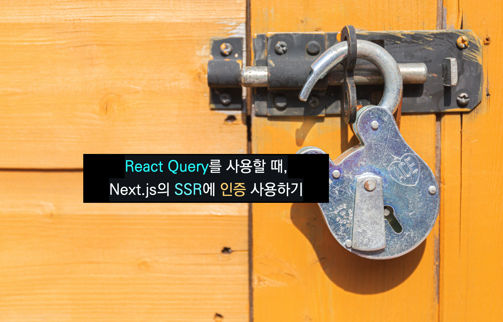

<div class="unsplash-wrapper">

<div class="unsplash-author">
사진: <a href="https://unsplash.com/ko/%EC%82%AC%EC%A7%84/Vp3oWLsPOss?utm_source=unsplash&utm_medium=referral&utm_content=creditCopyText">Unsplash</a>의<a href="https://unsplash.com/@imattsmart?utm_source=unsplash&utm_medium=referral&utm_content=creditCopyText">iMattSmart</a>
</div>
</div>

## 들어가며

이전의 `art.zip` 프로젝트에서는 각 페이지에서 `getServersideProps`
에 인증 로직을 위해 토큰을 첨부할 때 해당 함수에 토큰값을 넣어주었으나 `react-query`를 사용하여 구현할 때는 약간 다르게 구현해야할 부분이 있다. 이 글에서는 편의상 `tanstack query`를 `react query`로 표현한다.

## React Query를 이용한 SSR 구현 방법 (with Next.js)

> 참고 : [SSR | TanStack Query Docs](https://tanstack.com/query/v4/docs/react/guides/ssr)

`Next.js`의 SSR (`getStaticProps`, `getServerSideProps`)에서 `react query`를 이용하여 SSR을 구현하기 위해서는 다음과 같은 두 가지 방식을 사용할 수 있다.

- **`useQuery`의 `initialData`를 사용하는 방법**
  이 방식은 `getServersideProps`에서 데이터를 미리 가져오는 로직을 작성하면 이 후의 컴포넌트 로직에 `useQuery`의 `initialData`를 설정해주는 방식이다.
  이 경우, 구현은 쉽지만 **서버 데이터를 불러오는 기준이 페이지가 로드된 시점이 기준**이므로 **해당 서버 데이터를 전역 상태처럼 사용할 수 없다.** 따라서 `initialData`를 해당 `query`를 사용하는 쪽마다 따로 설정해주어야 한다. 또한 비슷한 논의로 해당 데이터는 해당 컴포넌트에만 존재하므로 이 데이터를 사용하는 하위 컴포넌트에 `initialData`를 전달하게 되므로 `props drilling` 현상이 일어날 수 있다.

- **`Hydration`을 사용하는 방법**
  이 방식은 `prefetchQuery`를 이용하여 **데이터가 필요하기 전에 `query`를 미리 실행하여 결과를 가져와 캐시에 저장하고** 이 `query`를 `qeuryClient`로 `hydration` 시키는 방법이다.

따라서 **`Hydration`을 사용하는 방법**을 이용하여 SSR을 사용해보자. 자세한 사용법의 경우 공식문서의 `Hydration` 부분에 잘 나와 있으므로, 본 글에서는 간단한 요약과 함께 원리를 설명한다.

- [`Hydration`을 이용한 SSR 설정 방법 | TanStack Query 공식 문서](https://tanstack.com/query/v4/docs/react/guides/ssr#using-hydration)

1. 우선 전체 앱 컴포넌트를 `QueryClientProvide`로 래핑하고 **`Hydration`을 사용하기 위하여 `<Hydrate>`로 한번 더 감싸준다.**

```typescript
// 코드 출처 : TanStack Query 공식 문서 (https://tanstack.com/query/v4/docs/react/guides/ssr#using-hydration)

// _app.tsx
import {
  Hydrate,
  QueryClient,
  QueryClientProvider,
} from '@tanstack/react-query'

export default function MyApp({ Component, pageProps }) {
  const [queryClient] = React.useState(() => new QueryClient())

  return (
    <QueryClientProvider client={queryClient}>
      <Hydrate state={pageProps.dehydratedState}>
        <Component {...pageProps} />
      </Hydrate>
    </QueryClientProvider>
  )
}
```

2.  서버에서 데이터를 패칭한다.

    `Next.js`를 사용하는 경우 `getServersideProps`와 같은 서버 사이드 데이터 패칭함수를 사용할 수 있다. 이 때, 일반적인 `react query`를 사용하지 않는 애플리케이션과 다른 점은 **서버 사이드 데이터 패칭함수에서 데이터를 패치한 후, 이를 prefetchQuery를 통하여 `QueryClient`에 데이터를 캐싱한다는 것이다.** 1.의 과정을 통해서 모든 페이지에서 `react query`를 이용해서 가져온 데이터를 `QueryClient`를 이용하여 전역적으로 사용할 수 있었다. 따라서 이 과정에서 `QueryClient`에 데이터를 캐싱하기 때문에 `initialData`와 다르게 해당 데이터를 앱 전역적으로 사용할 수 있다.

3.  `dehydrate`

    패칭한 데이터가 `QueryClient`에 있으므로, `QueryClient`에 있는 데이터를 가져와서 이를 클라이언트가 사용할 수 있는 형태로 변환하여 클라이언트에 리턴한다. 이렇게 변환된 상태를 `dehydrateState`라고 한다.

```tsx
// 코드 출처 : TanStack Query 공식 문서 (https://tanstack.com/query/v4/docs/react/guides/ssr#using-hydration)

// pages/posts.jsx
import { dehydrate, QueryClient, useQuery } from '@tanstack/react-query'

export async function getStaticProps() {
  const queryClient = new QueryClient()

  // 쿼리클라이언트에 가져온 데이터를 캐싱한다.
  await queryClient.prefetchQuery(['posts'], getPosts)

  return {
    props: {
      // `QueryClient`에 있는 데이터를 사용자가 사용할 수 있는 형태로 변환하여 클라이언트에 전달
      dehydratedState: dehydrate(queryClient),
    },
  }
}
```

4. `hydrate`
   클라이언트에서 `hydrate`를 통하여, 서버가 전달한 `dehydrateState` 상태를 현재의 `queryClient` 상태로 한다.

```tsx
// pages/posts.jsx
// 윗 부분 생략

function Posts() {
  // 해당 query가 실행될 때 hydrate 과정을 통하여 위에서 전달된 dehydrateState를 queryClient 상태로 한다.
  const { data } = useQuery({ queryKey: ['posts'], queryFn: getPosts })

  // ...
}
```

### prefetchQuery

> 참고 : [Prefetching | TanStack Query Docs](https://tanstack.com/query/v4/docs/react/guides/prefetching)

`react-query`의 `prefetchQuery`는 데이터가 필요하기 전에 `query`를 미리 실행하여 `query` 결과를 미리 가져와 캐시에 저장할 수 있다. 따라서 위의 서버 사이드 데이터 패칭 함수에서 `prefetchQuery`를 통하여 미리 결과를 가져온 후, `QueryClient`에 해당 값을 캐싱한다.

## 구현

그렇다면 이제 위의 SSR 로직에 **토큰을 첨부해서 데이터 패칭 로직을 구현**하면 된다. 또한 이 데이터는 토큰 값에 따라 변해야하는 데이터 이므로 **`query key`에 사용자 토큰을 첨부하면 토큰 값에 따라 다른 렌더링이 가능해진다.**

### query Key

`react-query`에서는 `query key`를 기준으로, 이 `key`가 변하면 데이터를 가져오는 작업을 한다. 만약에 어떤 id를 가진 페이지가 있고 해당 페이지가 렌더링될 때 이전의 유저의 동작을 유저의 엑세스 토큰을 통해서 불러온다고 하자. 그렇다면 해당 페이지의 렌더링 기준은 `게시글 id`와 `user의 access token`이 될 것이다.
따라서 `query key`에 게시글 `id`와 `access token`을 추가하여 다음과 같이 구현할 수 있다. 이러한 `query key`를 이용하여 해당 데이터를 불러오는 로직에 대한 `custom hook`을 만들어보자.

먼저 `query key`는 다음과 같은 방식으로 정의할 수 있다. 참고로 위의 페이지는 `detail` 이라고 가정한다.

```typescript
interface MeetKeysType {
  all: readonly string[]
  detail: (meetId: number, accessToken: string) => readonly string[]
  candidate: readonly string[]
}

export const meetKeys: MeetKeysType = {
  all: ['meet'] as const,
  detail: (meetId, accessToken) =>
    [...meetKeys.all, 'detail', meetId.toString(), accessToken] as const,
  candidate: ['meet-candidate'] as const,
}
```

이를 이용하여 서버 로직에 대한 커스텀 훅을 구현한다.
먼저, 데이터 패칭에 대한 훅의 구현 예시이다.

```typescript
import { AxiosResponse } from 'axios'
import { MeetDetailResponse } from '@types'
import { meetKeys } from '@queries'
import { getAccessToken } from '@utils'

// 데이터 가져오기 함수 (토큰이 없는 경우의 예외 처리는 eventAPI에 구현되어 있음)
export const fetchMeetDetail = async (eventId: number, token?: string) => {
  const { data }: AxiosResponse<MeetDetailResponse> = await eventAPI.getDetail(
    eventId,
    token
  )
  return data
}

// 데이터를 가져오는 커스텀 훅
const useMeetDetail = (eventId: number, token?: string) => {
  const csrToken = getAccessToken()

  return useQuery(
    meetKeys.detail(eventId, token ? token : csrToken ? csrToken : ''),
    () => getMeetDetail(eventId, token),
    {
      enabled: !!eventId,
    }
  )
}

export default useMeetDetail
```

이를 페이지 컴포넌트에서는 다음과 같이 사용한다.

```tsx
import { GetServerSideProps, GetServerSidePropsContext } from 'next'
import { useMeetDetail, getMeetDetail, meetKeys } from '@queries'
import { dehydrate, QueryClient } from '@tanstack/react-query'
import { ACCESS_TOKEN_KEY } from '@constants'

interface MeetDetailPageProps {
	meetId: number
	token: string
}

// 서버 사이드 데이터 패칭 함수
export const getServerSideProps: GetServerSideProps = async ({
	params,
	req,
	res,
}: GetServerSidePropsContext) => {
	// query key로 사용하기 위한 부분 1 : 토큰
	// 현재 토큰은 http 트랜젝션에 첨부되어있으므로 요청헤더에 쿠키로 저장되어있는 토큰을 가져온다.
	const accessToken = req.cookies[ACCESS_TOKEN_KEY] ? req.cookies[ACCESS_TOKEN_KEY]
													  : ''
	// query key로 사용하기 위한 부분 2. 게시글 id
	const meetId = parseInt(params?.meetId as string)

	const queryClient = new QueryClient()

	// prefetchQuery를 이용하여 QueryClient에 미리 가지고 온 값을 캐싱한다.
	try {
		await queryClient.prefetchQuery(meetKeys.detail(meetId, accessToken), ()
			getMeetDetail(meetId, accessToken),
		)
	} catch (e) { // 에러가 발생할 경우, 토큰을 정보를 지워준다.
		res.setHeader('Set-Cookie', [`ACCESS_TOKEN=deleted; Max-Age=0`])
	}

	return {
		props: {
		meetId,
		dehydratedState: dehydrate(queryClient),
		token: accessToken,
		},
	}
}

const MeetDetailPage = ({ meetId, token }: MeetDetailPageProps) => {
const { data } = useMeetDetail(meetId, token)
const detailData = data?.data

// ...
}


export default MeetDetailPage
```

## 결론

`react query`에서도 서버 사이드 렌더링을 구현하기 위해서 `hydrate`의 개념을 사용한다. 여기서 사용하는 `hydrate`는 우선 서버에서 데이터를 불러오고, 클라이언트가 실행될 때의 `queryClient`에 서버데이터를 `hydrate`시키는 의미이다.

또한 `query key`를 사용할 때, **데이터가 변하는 기준을 명확하게** 설정해야 데이터 패칭에 있어서 원하는 동작을 수행할 수 있다.

## 함꼐 보면 좋은 글

- [Recoil과 Cookie를 이용한 Next.js의 SSR 환경에서 전역 인증 관리하기 (JWT 토큰, 새로 고침 유지)](https://www.allsilver.dev/Technical/Recoil과-Cookie를-이용한-Nextjs의-SSR-환경에서-전역-인증-관리하기/)

## 참고 자료

- [Prefetching - tanstack query 공식 문서](https://tanstack.com/query/v4/docs/react/guides/prefetching)
- [SSR - tanstack query 공식 문서](https://tanstack.com/query/v4/docs/react/guides/ssr)
