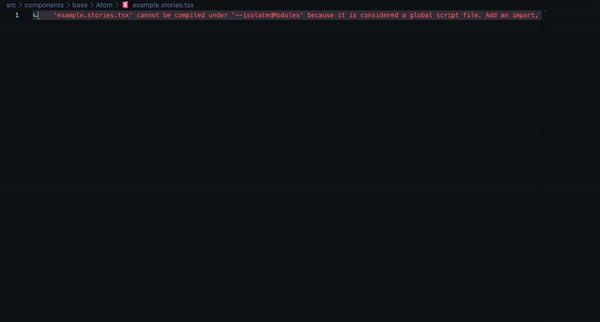
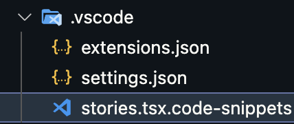
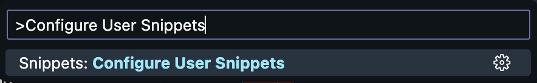
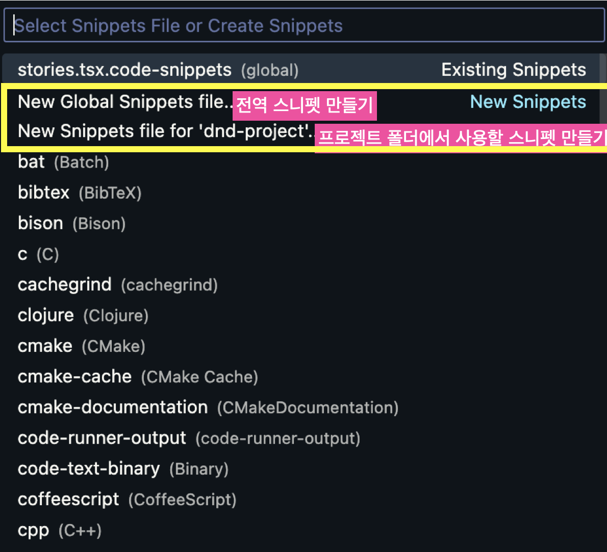

<div class="unsplash-wrapper">

<div class="unsplash-author">
Photo by <a href="https://unsplash.com/@jamessutton_photography?utm_source=unsplash&utm_medium=referral&utm_content=creditCopyText">사진: <a href="https://unsplash.com/ko/%EC%82%AC%EC%A7%84/oXlXu2qukGE?utm_source=unsplash&utm_medium=referral&utm_content=creditCopyText">Unsplash</a>의<a href="https://unsplash.com/@afgprogrammer?utm_source=unsplash&utm_medium=referral&utm_content=creditCopyText">Mohammad Rahmani</a>
</div>
</div>

## 사용 예시

스니펫을 설정하면, 다음 gif 처럼 동작하게 된다.



## 설정 방법

- [프로젝트 폴더에 설정하기](#프로젝트-폴더에-설정하기)
- [vscode 자체에 스니펫 만들기(커맨드 팔레트 이용)](#vscode-자체에-스니펫-만들기)

### 프로젝트 폴더에 설정하기

1.  스니펫 설정 파일 만들기 : `.vscode` 폴더에 (폴더가 없으면 만든다) `확장자.code-snippets` 파일을 생성한다.
    

2.  스니펫 작성하기 : 파일 안에 다음과 같은 형식으로 작성한다.

```JSON
{
  "Danverse Storybook Component": { // 템플릿 이름
    "prefix": "story", // 스니펫을 호출하는데 사용할 키워드
    "body": [ // 스니펫 본문, 스니펫 코드를 라인 단위로 배열의 원소로 넣는다.
      "import Atom from '.'",
      "import { ComponentStory, ComponentMeta } from '@storybook/react'",
      "",
      "/**",
      " * 스토리북 확인을 위한 샘플 파일입니다.",
      " */",
      "export default {",
      "  component: Atom,",
      "  title: 'Example/Atom',",
      "  parameters: {",
      "    componentSubtitle: '공통 컴포넌트로 사용되는 컴포넌트',",
      "  },",
      "  /**",
      "   * 컴포넌트에 대해 Container가 필요할 경우 decorators에 추가하면 됩니다.",
      "   */",
      "  decorators: [",
      "    (Story) => (",
      "      <div className=\"bg-blue-200 h-10 w-10\">",
      "        <Story />",
      "      </div>",
      "    ),",
      "  ],",
      "} as ComponentMeta<typeof Atom>",
      "",
      "const Template: ComponentStory<typeof Atom> = () => <Atom />",
      "",
      "export const Default = Template.bind({})",
      "Default.args = {}",
      ""
    ],
     "description": "스토리북 템플릿", // 스니펫 설명
  }
}
```

- `prefix` : 스니펫을 호출할 키워드, VSCode에서 `prefix`에 입력한 값을 입력 후 `tab` 키를 누르면 스니펫을 호출할 수 있다.
- `body` : 스니펫 본문. 해당 내용이 스니펫의 내용이다. 스니펫 코드가 있다면, 해당 코드를 line별로 잘라서 (JSON 문자열의) 배열로 저장한다. ([만약, 이미 작성된 코드가 있다고 하면 다음과 같은 함수를 이용할 수 있다.](https://www.allsilver.dev/%EA%B4%9C%EC%B0%AE%EC%9D%80%20%EC%83%9D%EA%B0%81/%ED%8C%8C%EC%9D%BC%EC%9D%84-line-%EB%B3%84%EB%A1%9C-%EC%AA%BC%EA%B0%9C%EC%84%9C-JSON-%EB%AC%B8%EC%9E%90%EC%97%B4%EC%9D%98-%EB%B0%B0%EC%97%B4%EB%A1%9C-%EB%B3%80%ED%99%98/))
- [그 외의 자세한 설명은 이 링크를 참고한다.](https://code.visualstudio.com/docs/editor/userdefinedsnippets)

<details>
<summary>참고: 파일을 읽고, 파일을 line 별로 쪼개서 JSON 문자열의 배열로 변환하는 함수</summary>
<div markdown="1">

```javascript
const fs = require('fs')

function readFileToJSONString(filePath, callback) {
  fs.readFile(filePath, 'utf8', (err, data) => {
    if (err) {
      console.error('Error reading file:', err)
      return
    }
    const lines = data.split('\n').map(line => JSON.stringify(line))
    callback(lines) // 실행 결과를 받은 후, 실행할 콜백 함수
  })
}

// 사용 예
const filePath = './example.tsx' // 원하는 파일 경로
readFileToJSONString(filePath, jsonResult => {
  console.log(jsonResult)
})
```

해당 코드를 실행 후, 실행 결과를 복사 붙여 넣기 하면 된다.

</div>
</details>

### vscode 자체에 스니펫 만들기

1.  **`Ctrl+Shift+P`**(Windows/Linux) 또는 **`Cmd+Shift+P`**(Mac)을 눌러 **커맨드 팔레트 창을 연다.**

2.  `Configure User Snippets` 를 입력하고, 해당 옵션을 선택한다.
    

3)  새로운 스니펫을 정의하기 위하여 `New Global Snippets file...` 을 클릭한다. (만약 프로젝트에서만 사용하려면 `New Snippets file for '프로젝트 폴더 이름'` 을 클릭한다)
    

4)  스니펫 파일을 작성한다. 아래는 `New Global Snippets file...` 선택 시, `VSCode`에서 제공하는 기본 예제이다.
    ```json
    {
      // Place your global snippets here. Each snippet is defined under a snippet name and has a scope, prefix, body and
      // description. Add comma separated ids of the languages where the snippet is applicable in the scope field. If scope
      // is left empty or omitted, the snippet gets applied to all languages. The prefix is what is
      // used to trigger the snippet and the body will be expanded and inserted. Possible variables are:
      // $1, $2 for tab stops, $0 for the final cursor position, and ${1:label}, ${2:another} for placeholders.
      // Placeholders with the same ids are connected.
      // Example:
      // "Print to console": {
      // 	"scope": "javascript,typescript",
      // 	"prefix": "log",
      // 	"body": [
      // 		"console.log('$1');",
      // 		"$2"
      // 	],
      // 	"description": "Log output to console"
      // }
    }
    ```
