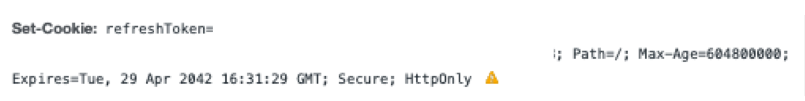

<div class="unsplash-wrapper">

<div class="unsplash-author">
사진: <a href="https://unsplash.com/ko/%EC%82%AC%EC%A7%84/4ujY2rb7KOQ?utm_source=unsplash&utm_medium=referral&utm_content=creditCopyText">Unsplash</a>의<a href="https://unsplash.com/@picsbyjameslee?utm_source=unsplash&utm_medium=referral&utm_content=creditCopyText">James Lee</a>
</div>
</div>

## TL;DR

- **클라이언트에서 set-cookie가 작동하지 않을 때 확인해야 하는 부분** -
  - 백엔드의 `Access-Control-Allow-Origin`, `Access-Control-Allow-Credentials`, `exposedHeader` 설정
  - 현재 환경에서의 `HTTPS` 설정
  - 프론트엔드 요청의 `withCredential` 설정

## 목차

- [들어가면서](#들어가면서)
- [배경 지식](#배경-지식)
  - [이해해야 할 쿠키의 옵션](#이해해야-할-쿠키의-옵션)
  - [요청 헤더 설정](#요청-헤더-설정)
  - [현재 브라우저에서 사용되는 쿠키 정책 (`SameSite`, `Secure Cookie`)](#현재-브라우저에서-사용되는-쿠키-정책-samesite-secure-cookie)
  - [요약](#요약)
- [로컬 개발 환경을 HTTPS로 설정하기](#로컬-개발-환경을-https로-설정하기)
- [CORS 회피하기](#cors-회피하기)
  - [1. 백엔드 설정 : `Set-Cookie` 헤더 노출시키기 (`exposedHeader`)](#1-백엔드-설정--set-cookie-헤더-노출시키기-exposedheader)
  - [2. 백엔드 설정 : `Access-Control-Allow-Origin`, `Access-Control-Allow-Credentials](#2-백엔드-설정--access-control-allow-origin-access-control-allow-credentials)
  - [3. 클라이언트 설정 : `withCredential](#3-클라이언트-설정--withcredential)
- [결론](#결론)
- [함께 보면 좋은 글](#함께-보면-좋은-글)
- [참고 자료](#참고자료)

## 들어가면서

DND 프로젝트에서 인증 로직을 구현하면서, 클라이언트에서 로그인 API를 호출했을 때, 백엔드는 `Set-cookie` 헤더를 통해 쿠키를 설정해주는 방식을 사용하였다.
이를 위해 클라이언트 측에서 쿠키 옵션과 개발 환경 설정을 조정해야 했다. 이 글에서는 **서버에서 클라이언트에 `set-cookie`를 정상적으로 설정하고, 클라이언트에서 쿠키를 사용할 수 있도록 옵션을 설정하는 방법과 개발 환경을 구성하는 방법에 대해 설명한다.**

> 주의! 글은 프론트엔드 위주입니다. 백엔드 부분에 대한 내용은 간단하게 설명하고, 참고자료를 첨부합니다.

## 배경 지식

문제를 해결하기 위해서는 다음의 배경 지식이 필요하다: `현재 브라우저에서 사용되는 쿠키 정책`, `쿠키의 옵션 및 HTTP 요청 헤더 설정값` .

**현재 브라우저에서 사용되는 쿠키 정책**은 백엔드가 프론트엔드에 `set-cookie`를 설정할 때 중요하다. 브라우저가 쿠키를 설정하는 주체이기 때문에, 해당 브라우저의 쿠키 정책에 따라 코드를 작성해야 한다. 따라서 이를 알아둘 필요가 있다.

**쿠키의 옵션**은 백엔드와 프론트엔드 간에 네트워크 통신으로 쿠키를 주고 받을 때 중요하다. CORS를 회피하기 위해 각 경우에 쿠키 옵션을 설정해주어야 한다. 이 옵션들을 이해함으로써 올바르게 쿠키를 설정하고 개발 환경을 구성할 수 있다.

**HTTP 요청 헤더 설정값**은 클라이언트에서 네트워크 요청을 보낼 때, 백엔드와 프론트엔드 도메인간의 자원 공유를 위해 필요하다. 이 역시 CORS를 회피하기 위한 옵션이며, HTTP 요청 헤더의 `withCredentials` 속성을 설정해야 백엔드에서 HTTP 트랜잭션에 포함시킨 쿠키 값이나 인증 정보를 정상적으로 주고 받을 수 있다.

### 이해해야 할 쿠키의 옵션

아래의 설정을 위해 이해해야 할 쿠키의 옵션과 설정은 다음과 같다.

- `secure` : 이 값이 `true`로 설정된다면, `https` 환경에서만 쿠키를 주고 받을 수 있다. 만약 `https` 가 설정되지 않았다면 네트워크 탭에서 다음과 같이 표시된다.

    <figure>
      
       <figcaption class="caption">set-cookie 지정하지 않을 시 확인할 수 있는 아이콘      </figcaption>
    </figure>

- `SameSite` : 서로 다른 도메인간의 쿠키 전송에 대한 보안을 설정한다. 로컬 개발 환경에서 백엔드 서버와 쿠키를 주고 받는다면 둘의 도메인이 다르므로 `SameSite=None` 옵션을 사용하게 되는데, 이를 사용하기 위해서는 `secure` 쿠키 사용이 강제된다. 이에 대한 설명은 아래의 **현재 브라우저에서 사용되는 쿠키 정책** 에서 더 자세히하겠다.

그 외에 글과는 직접적으로 관련 없지만 알아두면 좋을 쿠키의 옵션도 함께 작성한다.

- `path` : 쿠키가 사용되는 URL 경로를 지정한다. **이 속성을 `/`로 설정해야 모든 페이지에서 쿠키를 사용할 수 있다.**
- `Expires/Max-Age` : 쿠키의 만료 날짜 또는 최대 사용 기간을 설정한다. `Next.js`와 같은 서버 사이드에서 쿠키를 제어 할 때, `Set-Cookie`와 해당 옵션을 이용하여 쿠키를 삭제할 수 있다.

### 요청 헤더 설정

- `withcredentials` : `withCredentials`는 웹 요청 시, 쿠키와 인증 헤더를 전송할 지 여부를 결정한다. 조금 더 쉽게 설명해보자면 용어 `withCredential` 이라는 단어에서 알 수 있듯이 **보내는 요청에 자격이 있음이 증명되어 있다**라는 뜻이다.

### 현재 브라우저에서 사용되는 쿠키 정책 (SameSite, secure cookie)

크롬 80버전 (2020년 2월 4일 이후) 부터 **새로운 쿠키 정책이 적용되어, Cookie의 `SameSite` 속성의 기본값이 `None`에서 `Lax`로 변경되었다.**
이는 쿠키의 **CSRF 문제**를 해결하기 위하여 탄생하게 되었는데, 이 공격에 대해서 간단하게 요약하면 "HTTP 트랜잭션에서 자동으로 붙어나가는 쿠키를 탈취하여 쿠키에 들어있는 사용자 정보나 권한을 악용한다"라고 요약할 수 있다.

이러한 공격을 막기 위하여 `SameSite` 정책이 등장하였으며 이는 다음과 같은 값을 가진다.

- `SameSite=Strict` : 쿠키가 같은 도메인 내에서만 전송된다.
- `SameSite=Lax` : 동일한 도메인이 아닌 경우에도 일부 요청에 대해서는 쿠키를 전송한다. 예를 들어 `GET`과 같은 `안전한 메서드`를 사용한 요청이거나 `a href`, `link href`를 사용하는 경우에 쿠키를 전송한다.
- `SameSite=None` : 다른 도메인에 대한 요청 (크로스 사이트 요청)의 경우에도 쿠키가 전소오딘다.

그러나 백엔드 api 서버의 도메인과 클라이언트의 도메인이 다른 일이 많으므로 `SameSite` 설정이 보수적으로 설정된다면 사용자 경험에 영향을 줄 수 있다. 따라서 `SameSite=None` 옵션을 사용하되, 이 옵션을 통하여 **주고 받는 쿠키에 `secure`을 설정하는 것을 강제하여 HTTPS 요청에서만 쿠키를 주고 받게 한다.** 이를 통하여 HTTPS를 통한 모든 응답과 그에 붙어나가는 쿠키 역시 HTTPS가 제공하는 암호화에 의하여 암호화된다. 따라서 중간에 쿠키를 가져가서 쿠키에 들어있는 유저 정보를 가져가려고 해도 암호화되어있기 때문에 확인할 수 없는 것이다.

### 요약

따라서, 개발 환경에서 백엔드에서 직접 설정해주는 `set-cookie`를 정상적으로 이용하려면 다음과 같은 설정이 필요하다고 요약할 수 있다.

- 로컬 개발 환경을 HTTPS로 설정하기 (`SameSite`, `secure cookie` 문제 해결) - 개발환경에서는 대부분 `localhost`를 사용하므로, 이와 다른 도메인을 사용하는 백엔드 서버가 클라이언트 개발 환경에 쿠키를 설정하기 위해서는 `SameSite=None` 을 사용해야 하는데, 위에서 언급했듯이 가장 많이 사용하는 브라우저인 `Chrome` 브라우저의 경우, 브라우저 정책상 이 옵션을 사용하려면 **반드시 `Secure=true` 설정이 필요하다.** 또한 `Secure=true`의 쿠키를 읽기 위해서는 반드시 클라이언트도 HTTPS를 사용하여야 한다. **따라서 로컬 개발 환경을 HTTPS로 설정하여, `SameSite=None`과 `Secure=true`의 옵션에서 쿠키를 읽을 수 있도록 한다.**

- 백엔드와 프론트엔드에서 **HTTP 메시지 헤더 옵션 설정** 하기 (`CORS` 문제 해결) - 백엔드와 프론트엔드에서 CORS 문제를 회피하기 위하여 각각 HTTP 요청 및 응답에 대한 설정을 해줘야 한다. 백엔드에서는 프론트엔드의 도메인을 `Access-Control-Allow-Origin` 에 등록해야하고, 프론트엔드의 쿠키값을 읽기 위하여 `Access-Control-Allow-Credentials` 설정을 해야 한다. 또한 HTTP 응답의 `Set-cookie` 헤더 역시 노출해야 하므로 이에 관련 한 설정도 필요하다. - 프론트엔드 역시 백엔드에서 프론트엔드의 요청에 자격이 있는지 증명하기 위하여 `withCredential` 에 대한 설정이 필요하다.

## 로컬 개발 환경을 HTTPS로 설정하기

위에서 설명한 내용처럼, 브라우저의 정책 상 `SameSite=none` 속성이 있다면, 항상 `secure cookie`를 이용하여 쿠키를 주고 받게 된다. **이 쿠키는 `https`에서만 주고 받을 수 있으므로 브라우저 로컬 개발환경 역시 `https`로 설정할 필요가 있다.**

**클라이언트에서 `Next.js`를 사용한다고 가정할 때**, `https`를 설정하는 방법은 아래의 자료를 참고한다.

- 참고자료 : [[Nextjs] 로컬 개발 환경(localhost)에 https 적용하기](https://satisfactoryplace.tistory.com/369)

이 자료를 토대로 요약해보면 다음과 같이 요약할 수 있다.

1. 인증 기관 설치 후 로컬 인증서 발급 ([`mkcert` 라이브러리](https://github.com/FiloSottile/mkcert) 사용)
2. Next.js custom server를 통하여, 해당 인증서를 사용하는 https 서버를 띄우기
3. 쉘 스크립트로 자동화 하기

다른 프레임워크나 라이브러리에서도 [`mkcert` 라이브러리](https://github.com/FiloSottile/mkcert)를 통하여 로컬 인증서를 발급하고 이를 이용하여 개발 환경에서 `https`를 사용할 수 있다.

## CORS 회피하기

쿠키의 옵션 설정의 경우, 백엔드 - 클라이언트 양쪽의 설정이 필요하다.

### 1. 백엔드 설정 : `Set-Cookie` 헤더 노출시키기 (`exposedHeader`)

<figure>
    
    <figcaption class="caption">이 설정을 하지 않으면 위와 같은 오류 메시지를 확인할 수 있다.</figcaption>
</figure>

- [참고 자료 : Axios Response header의 값이 없는 경우에 대해](https://bogmong.tistory.com/5)
  우선 클라이언트에서 쿠키를 정상적으로 받기 위해서는 백엔드에서 [다음과 같은 설정(`exposedHeaders` 설정)](https://bogmong.tistory.com/5)을 해주어야한다 백엔드에서 클라이언트에 쿠키를 설정해 줄 때 `HTTP 응답 Header`를 사용하여 설정을 하게되고, 클라이언트는 이 `Header`를 활용하여 클라이언트 앱에서 쿠키를 설정하게 되는데 위의 설정이 없다면 **클라이언트에서 읽을 수 있는 HTTP 응답 헤더의 값이 제한되기 때문에** 정상적으로 `Set-cookie`와 같은 헤더를 읽을 수 없다. 설정을 하지 않고 크롬 개발자 도구의 `Network` 탭에서 HTTP 응답을 확인해보면 `Provisional headers are shown` 이라는 메시지를 확인할 수 있는데, 이는 일종의 CORS 에러라고 할 수 있다. 즉, 클라이언트 (cross domain)에 해당 헤더를 노춣하지 않는 정책을 사용하기 때문에 헤더가 정상적으로 보이지 않는 것이다.

### 2. 백엔드 설정 : `Access-Control-Allow-Origin`, `Access-Control-Allow-Credentials`

- 참고 자료 : [쿠키가 발급되지 않을 때, Access-Control-Allow-Origin 오류 해결 방법](https://hini7.tistory.com/165)
  우선 `Access-Control-Allow-Origin` 에 프론트엔드에서 사용하는 도메인을 설정한다. 이를 설정한다면 프론트엔드 도메인에서 백엔드의 리소스에 접근할 수 있다.
  이 후, `Access-Control-Allow-Credentials` 헤더를 `true`로 설정한다. 이 헤더는 자격 증명이 포함된 요청(즉, 클라이언트에 HTTP 요청에 쿠키나, Authorization 헤더등이 포함된 요청)을 허용할지의 여부에 관한 헤더이다. 이 값을 `true`로 설정한다면 클라이언트에서 `withCredentials` 옵션이 활성화된 요청을 보낼 때, 서버가 클라이언트의 쿠키와 인증 정보를 포함된 요청을 받아들일 수 있다.

### 3. 클라이언트 설정 : `withCredential`

> `withCredentials`는 웹 요청 시, 쿠키와 인증 헤더를 전송할 지 여부를 결정한다. 조금 더 쉽게 설명해보자면 용어 `withCredential` 이라는 단어에서 알 수 있듯이 **보내는 요청에 자격이 있음이 증명되어 있다**라는 뜻이다.

이 설정을 통하여 (2.의 설정이 완료된) 백엔드에서 클라이언트의 쿠키와 인증 정보를 읽을 수 있다.

사용 예시는 `fetch API`와 `axios` 기준으로 작성한다.

- `fetch API`

```javascript
fetch('https://api.example.com/data', { method: 'GET', credentials: 'include' })
  .then(response => response.json())
  .then(data => console.log(data))
  .catch(error => console.error(error))
```

- `axios`

```javascript
import axios from 'axios'

axios
  .get('https://api.example.com/data', {
    withCredentials: true,
  })
  .then(response => console.log(response.data))
  .catch(error => console.error(error))
```

## 결론

최근 프론드엔드에서 자주 사용하는 SSR 방식으로 인증 로직을 구현할 때, 서버 사이드 환경에서는 `localStorage`에 접근할 수 없으므로 쿠키를 이용한 인증 방식을 많이 사용하게 된다.
쿠키를 이용할 때, 백엔드에서 `header`나 `body`에 쿠키를 보내주고 이 값을 클라이언트에서 읽어서 클라이언트에서 직접 쿠키를 set 하여 사용하는 방법도 있으나, 이 방법의 경우 **자바스크립트 코드를 통하여 언제든지 쿠키에 접근할 수 있으므로 보안 상 좋지 않다.**
따라서, 서버에서 `set-cookie`를 이용하여 클라이언트에 직접 쿠키를 set 해준다면 클라이언트에서 해당 쿠키에 대한 접근할 필요 없이 HTTP 트랜잭션에 쿠키를 자동으로 첨부하여 주고 받을 수 있다.
그러나 이러한 방식은 네트워크 상에서 쿠키가 왔다갔다 하는 방식으므로 또 다른 보안 문제가 있으며 이러한 보안문제를 해결하기 위해 브라우저 정책과 백엔드 서버에 여러 설정이 필요하고, 이 설정에 따라 프론트엔드가 구현할 수 있도록 프론트엔드 내부에서도 관련 설정과 관련 내용을 알아 둘 필요가 있다.

## 함께 보면 좋은 글

- [[HTTP 완벽 가이드] 11. 클라이언트 식별과 쿠키](https://www.allsilver.dev/%EB%8F%85%EC%84%9C/HTTP_11/)

## 참고자료

- [브라우저 쿠키와 SameSite 속성 - seob.dev](https://seob.dev/posts/%EB%B8%8C%EB%9D%BC%EC%9A%B0%EC%A0%80-%EC%BF%A0%ED%82%A4%EC%99%80-SameSite-%EC%86%8D%EC%84%B1/)
- [Cookie SameSite 설정하기 (Chrome 80 쿠키 이슈) - 티스토리 블로그 (Ifuwanna IT)](https://ifuwanna.tistory.com/223)
- [Chrome 브라우저에서 SameSite 쿠키 변경 내용 처리 - microsoft azure 설명서](https://learn.microsoft.com/ko-kr/azure/active-directory/develop/howto-handle-samesite-cookie-changes-chrome-browser?tabs=dotnet)
- [Axios Response header의 값이 없는 경우에 대해 - 티스토리 블로그 (보그몽 코드몽)](https://bogmong.tistory.com/5)
- [다른 도메인간 쿠키 전송하기(axios와 express 예제) - zerocho.com](https://www.zerocho.com/category/NodeJS/post/5e9bf5b18dcb9c001f36b275)
- [쿠키가 발급되지 않을 때, Access-Control-Allow-Origin 오류 해결 방법](https://hini7.tistory.com/165)
