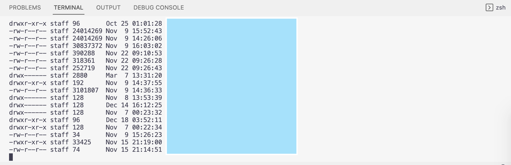
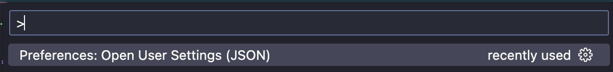

# 환경
- VS Code Version : 1.76.0 (Universal)
- OS Version : macOS 13.0(22A380)

# 문제 현상

비주얼 스튜디오 코드의 터미널을 열었을 때, 아래와 같은 내용이 출력된 이후 즉시 종료되는 현상




# 해결 방법

1. `Command` + `Shift` + `'P'` 입력 후, 검색 창에 `Preferences: Open User Settings (json)` 입력 후 접근 




2. 다음의 설정 추가
```json
  "terminal.integrated.profiles.osx": {
    "zsh": {
      "path": "/bin/zsh", // 터미널 설치 path 
      "args": ["-l"]
    }
  },
```

# 참고 자료
> **[Terminal Immediately Closes on macOS Big Sur #147460 (microsoft/vscode Issues)](https://github.com/microsoft/vscode/issues/147460)**