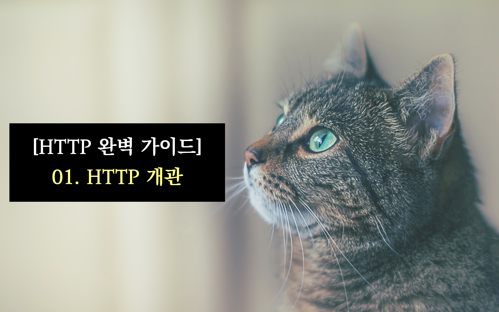

Photo by <a href="https://unsplash.com/@jamessutton_photography?utm_source=unsplash&utm_medium=referral&utm_content=creditCopyText">James Sutton</a> on <a href="https://unsplash.com/images/animals/cat?utm_source=unsplash&utm_medium=referral&utm_content=creditCopyText">Unsplash</a>

 

> 💡 HTTP는 TCP/IP 계층 위 에서 동작하므로, 아래 계층에서 제공하는 기능들(신뢰성 있는 전송, 데이터 순서 등)을 기본적으로 보장함을 전제로 한다.

## 키워드

`HTTP`, `TCP/IP`, `웹 리소스`, `MIME Type`, `URI`, `URL`, `HTTP 트랜잭션`, `프록시`, `캐시`, `게이트웨이`

## 메모 및 핵심 요점

- **HTTP는 TCP/IP 계층 위 에서 동작하므로, 아래 계층에서 제공하는 기능들(신뢰성 있는 전송, 데이터 순서 등)을 기본적으로 보장**함을 전제로 한다. 즉, HTTP에서는 네트워크의 애플리케이션 계층에서는 이 기능을 보장된다고 생각하고, 신경쓰지 않아도 된다. (해당 기능을 HTTP 에서 제공하지 않는다)
- **웹 리소스**란 **결과물로 웹 콘텐츠가 나오는 것**을 의미한다. 따라서 웹 리소스는 콘텐츠 그 자체(정적 파일)이 될 수 있고, 동적으로 콘텐츠를 만들어내는 프로그램(🌧️ JavaScript 코드를 의미하는 듯하다. 이 JavaScript 코드가 실행되면서 화면에 콘텐츠를 그려낸다.)이 될 수도 있다.
- **MIME Type**은 HTTP를 통하여 주고 받는 **데이터에 타입**에 대한 라벨을 붙인 것이다. 이 MIME Type을 이용하여 클라이언트 측에서는 클라이언트 측에서 다룰 수 있는 (다룰) 데이터의 타입 표현하며, 서버 측에서는 서버에서 전송한 데이터의 타입을 표현한다.
- URI(Uniform Resource **Identifier**)은 **웹 리소스에 대한 식별자**를 의미한다(🌧️ 즉 이 식별자를 통하여 원하는 웹 리소스를 **찾아간다**). 이 식별자로 웹 리소스의 위치를 사용하는 경우를 URL(Uniform Resource **Locator**)라고 하며, 웹 리소스의 이름 자체를 사용하는 경우를 URN(Uniform Resource **Name**)이라고 한다.
  - **URL**은 **웹 리소스의 정확한 위치와 이 리소스를 어떻게 접근하는지에 대한 정보**를 포함한다. 현재 URI라고 하면 URL을 의미한다. URL은 세 가지 구성 요소 - 스킴, (리소스를 제공하는)서버의 인터넷 주소, 리소스 위치 - 로 이루어져 있다. 스킴은 사용하는 프로토콜의 종류를 나타낸다.
  - URN은 웹 리소스의 unique한 **이름**을 의미한다. 따라서 위치가 변화하더라도 이름만으로 해당 리소스를 식별해낼 수 있다. 그러나 이 이름을 찾아가기 위한 인프라가 아직 구축되어있지 않기 때문에 (🌧️ 이름을 통해 위치를 파악할 수 있는 인프라를 의미하는 듯 하다) 많이 사용하고 있지 않고, 현재 연구 중인 기술이다.
- HTTP 트랜잭션이란 클라이언트와 서버의 요청과 응답의 과정을 의미한다. **HTTP 요청**에는 **HTTP 요쳥에 대한 내용**을 나타내고, **명령과 URI**를 포함한다. **HTTP 응답은 트랜잭션의 결과**를 나타내는데, 이 결과는 **HTTP 상태 코드** (+ reason phase)를 포함한다. 이러한 HTTP 요청과 응답은 **메시지**형태로 주고 받는다.
  - HTTP 트랜잭션에서 사용하는 HTTP 메시지는 시작줄 + 헤더 + 본문 (body)의 형태를 취한다.
- HTTP는 TCP/IP 위에서 동작하므로, **HTTP 트랜잭션이 이루어지기 전에 TCP/IP connection이 선행**된다. 따라서 HTTP 요청 메시지를 보낼 때, **TCP/IP connection 을 위하여 서버의 IP 주소와 포트 번호가 필요**하다. **서버의 IP 주소는 URI를 통해** DNS 서버에 접근하여 알아낼 수 있고 **포트의 경우 80번(**웹 서버의 경우 디폴트 값) 포트를 사용한다.
  - 결국 HTTP 리소스를 보여주는 과정은 **1. TCP/IP connection 2. HTTP 요청 및 응답 (HTTP 트랜잭션) 3. connection closed** 의 과정으로 표현할 수 있다.
- 현재의 HTTP 버전은 `HTTP/1.1` 이다.
- **프록시**는 **서버와 클라이언트 사이의 (신뢰할 수 있는) 중재자 역할**을 한다. 즉, 서버와 클라이언트 사이에 존재하면서 클라이언트에서 어떤 HTTP 요청을 보낸다면 이 요청을 받아 프록시가 서버에 HTTP 요청을 전달해주는 식이다(물론 반대도 성립한다). 이러한 프록시는 **주로 보안을 위해서 사용하며, 요청과 응답에 대한 필터링** 역할을 한다.
- **캐시**는 성능의 효율성을 위하여 **사용자가 자주 접근하는 내용들의 사본을 저장하는 사용자와 가까운 서버를 의미**한다(예를 들어 CDN이 있다. 🌧️ 이러한 캐시를 이용한 기술을 edge computing이라고 한다). 이러한 서버는 프록시를 이용하여 구현한다. (🌧️ 즉, 사용자와 호스트 서버 사이에 자주 사용하는 리소스를 저장하는 서버를 하나 더 두는 것을 생각하면 된다.)
- **게이트웨이**는 **각 서버들의 중재자**로, **주로 HTTP 프로토콜을 다른 프로토콜로 변환하기 위하여 사용**한다. (🌧️ 예를 들어, 사용자가 파일 전송을 위하여 FTP 서버를 이용해야한다고 생각하자. 그렇다면 이 서버와 통신하기 위해서는 FTP 를 이용하여 통신을 해야한다. 이 때 게이트웨이를 사용한다면 사용자 단에서 FTP 를 생각할 필요 없이 HTTP 요청을 하면, 게이트웨이가 이 요청을 FTP 로 바꾸어서 FTP 서버에 전달하게 되고, 서버의 응답 역시 게이트웨이가 HTTP 응답으로 변환하여 클라이언트에 돌려준다.)
- **터널**은 두 커넥션 사이의 **데이터를 열어보지 않고 그대로 전달**하기만 하는 특별한 프록시이다. 주로 HTTP 데이터가 아닌 것을 HTTP 연결을 통하여 그대로 전송하기 위하여 사용한다. 주로 보안을 위해 사용하며, 이 때 터널은 데이터를 바깥에서 보지 못하고, 잘 지나갈 수 있도록 보호하는 역할을 한다.
- 에이전트는 사용자를 위해 HTTP 요청을 만들어주는 클라이언트 프로그램이다.

## 인용

> HTTP는 신뢰성 있는 데이터 전송 프로토콜을 사용하기 때문에, 데이터가 지구 반대편에서 오더라도 전송 중 손상되거나 꼬이지 않음을 보장한다. (4p)

> 예를 들어, 웹 브라우저는 시각적으로 풍부한 웹페이지를 가져올 때 대량의 HTTP 트랜잭션을 수행한다. (중략) 이 리소스들은 그림 1-6에 묘사된 것과 같이 다른 서버에 위치할 수도 있다. 이와 같이 ‘웹페이지’는 보통 하나의 리소스가 아닌 리소스의 모음이다. (11p)

> HTTP는 네트워크 통신의 핵심적인 세부사항에 대해서 신경 쓰지 않는다. 대신 대중적이고 신뢰성 있는 인터넷 전송 프로토콜인 TCP/IP에게 맡긴다. (14p)

> TCP/IP는 각 네트워크와 하드웨어의 특성을 숨기고, 어떤 종류의 컴퓨터나 네트워크든 서로 신뢰성 있는 의사소통을 하게 해 준다. (14p)
