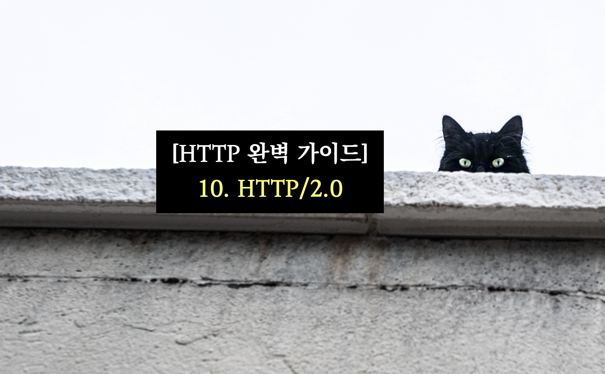

사진: <a href="https://unsplash.com/ko/%EC%82%AC%EC%A7%84/b9K_LTz079c?utm_source=unsplash&utm_medium=referral&utm_content=creditCopyText">Unsplash</a>의 <a href="https://unsplash.com/@centelm?utm_source=unsplash&utm_medium=referral&utm_content=creditCopyText">Clément Falize</a>
  

> HTTP/2.0은 기존 HTTP/1.1에 대하여 성능 개선을 위하여 고안되었다.
>
> 주로 회전 지연을 줄이기 위한 방안을 제시하며,
> 이를 위하여 프레임과 스트림을 사용하여 하나의 커넥션에 대하여 여러 개의 스트림을 사용할 수 있다.

## 키워드

`회전 지연`, `HTTP/2.0`, `프레임`, `스트림`

## 메모 및 핵심 요점

- HTTP/1.1이 느린 이유 : 회전 지연 (응답을 받아야만 그 다음 요청을 보낼 수 있음)
- HTTP/2.0에서 성능 개선을 위하여 **회전 지연**을 줄이기 위한 방안들을 제시
  - 헤더는 압축되어 담긴다.
  - 프레임들에 담긴 요청과 응답은 스트림을 통해 보내진다. (한 개의 스트림이 한 쌍의 요청과 응답을 처리한다) ⇒ 따라서 하나의 커넥션에 여러 개의 스트림이 존재할 수 있다. (🌧️ 응답과 요청이 묶여 있으므로)
- 추가 된 기능
  - 프레임 : 모든 메시지는 프레임에 담겨 전송.
  - 스트림 : HTTP/2.0 커넥션을 통해 클라이언트와 서버 사이에서 교환되는 프레임들의 독립된 양방향 시퀀스.
  - 헤더 압축
  - 서버 푸시 : 서버가 하나의 요청으로 여러 개의 리소스를 보낼 수 있도록 해준다. (서버가 클라이언트에서 어떤 리소스를 요구할 것인지 미리 알 수 있는 상황에서 유용)

## 스크랩

참고자료 : [웹 개발자라면 알고 있어야 할 HTTP의 진화 과정](https://yozm.wishket.com/magazine/detail/1686/)

- 표준 이전의 HTTP : `HTTP/0.9`, `HTTP/1.0`
  - `HTTP/1.0` : 서버와 클라이언트의 기능을 일관성 있게 구현하기 위함. 즉, HTTP의 구조를 요구하면서 다양한 요구사항을 충족시키고 표준화.
- `HTTP/1.1` : 표준화된 HTTP, 기존의 `HTTP/1.0`에서 **지속 커넥션 (연결 상태 유지, Persisted Connection)** 과 **파이프라이닝** 등의 추가
- `HTTPS` : HTTP Secure, 암호화된 HTTP 통신. 대화 상대가 서로 자신이 신뢰할 수 있음을 증명하는 인증서를 사용하고 (**신뢰성** 보장, 비대칭 키 암호화 이용), 통신 내용은 SSL(Secure Socket Layer), TLS(Transport Layer Security)라는 프로토콜로 암호화.
- `RESTful` : HTTP의 메서드를 활용하여 CRUD를 구현하고 UR를 이용하여 자원을 명시함으로써, HTTP를 기반으로 웹의 장점을 최대한 활용할 수 있는 데이터 통신 아키텍처.
- `HTTP/2` : `HTTP/1.1`에서 성능 개선을 위한 버전.
  - 기존 버전의 문제점 : 헤더의 중복, 회전 지연(HOLB, Head-of-Line Blocking), 요청 별 우선 순위 지정 불가, 클라이언트 기반 통신 (서버에서 클라이언트 측으로 데이터를 전송할 수 있는 기능이 없음)
  - 특징 : binary 프로토콜 (보내야 할 데이터를 바이너리로 변환하여 효율적으로 데이터 전송), 응답 다중화(multiflexing, 하나의 TCP 연결에서 여러 요청을 동시에 처리함), 헤더 필드 압축(HPACK, 허프만 코딩 방식으로 달라진 부분만 전송), 서버 푸쉬, 우선 순위 지정, 흐름 제어 등
- `HTTP/3` : TCP로 인해 발생되는 문제를 해결하기 위한 프로토콜, HTTP over QUIC (QUIC : TCP의 신뢰성 보장을 위해 제공되는 기능을 UDP 기반으로 직접 구현하여 성능을 개선한 프로토콜)
  - 기존 버전의 문제점 : TCP 프로토콜 자체의 병목 현상과 속도 문제
  - 특징 : **QUIC**이라는 프로토콜 위에서 동작, 연결 정보를 캐싱하여 재사용 (**0-RTT**, 연결 수립에 필요한 3-way 핸드셰이크 과정에 캐시를 이용), 연결 다중화를 지원하며 각 스트림이 완전히 독립적으로 동작, 연결 별 고유 UUID (Connection ID)를 이용해 각 연결을 식별.

## 인용

> 한편 2009년, 구글은 웹을 더 빠르게 하겠다는 목표 아래 SPDY(’스피디’라고 읽는다) 프로토콜을 내놓았다. SPDY는 기존의 HTTP에 속도를 개선하기 위한 여러 기능을 추가한 것이다. SPDY는 헤더를 압축하여 대역폭을 절약했고, 하나의 TCP 커넥션에 여러 요청을 동시에 보내 회전 지연을 줄이는 것이 가능했으며, 클라이언트가 요청을 보내지 않아도 서버가 능동적으로 리소스를 푸시하는 기능도 갖추고 있다. (288p)

> 프레임들에 담긴 요청과 응답은 스트림을 통해 보내진다. 한 개의 스트림이 한 쌍의 요청과 응답을 처리한다. 하나의 커넥션 위에 여러 개의 스트림이 동시에 만들어질 수 있으므로, 여러 개의 요청과 응답을 동시에 처리하는 것 역시 가능하다.
> HTTP/2.0은 이들 스트림에 대한 흐름 제어와 우선순위 부여 기능도 제공한다. (288p)

## 참고자료

[웹 개발자라면 알고 있어야 할 HTTP의 진화 과정](https://yozm.wishket.com/magazine/detail/1686/)

[HTTP/3 RFC 9114](https://datatracker.ietf.org/doc/rfc9114/)
