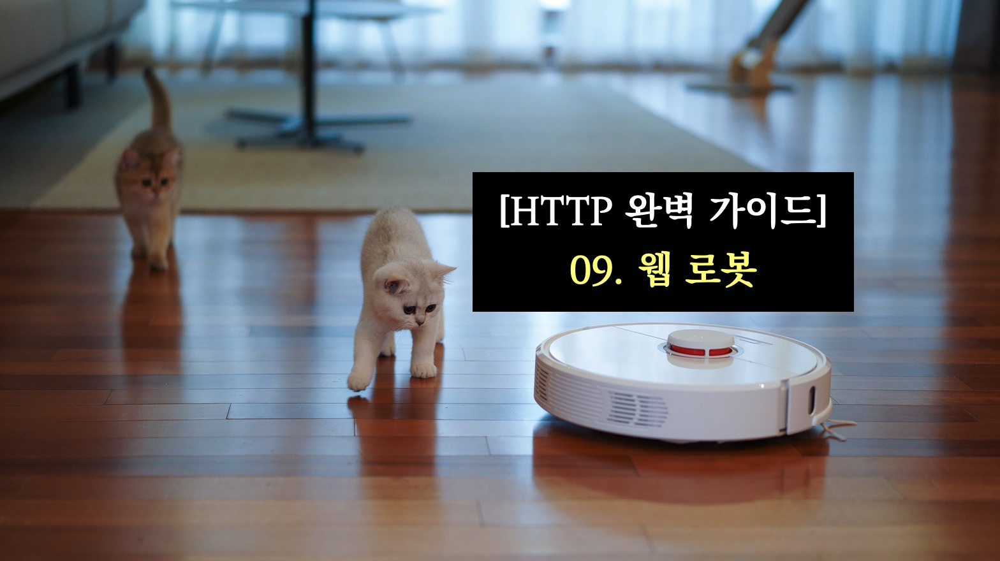

<div class="unsplash-wrapper">

<div class="unsplash-author">
사진: <a href="https://unsplash.com/ko/%EC%82%AC%EC%A7%84/p7MsAMLSbbU?utm_source=unsplash&utm_medium=referral&utm_content=creditCopyText">Unsplash</a>의 <a href="https://unsplash.com/ja/@houston100?utm_source=unsplash&utm_medium=referral&utm_content=creditCopyText">YoonJae Baik</a>
</div>
</div>

> 웹 로봇은 사람과 상호작용 없이 연속된 웹 트랜잭션을 계속하여 수행하는 HTTP 클라이언트 프로그램의 일종이다.
>
> 이 웹 로봇은 웹 링크를 돌아다니며 만나는 문서를 끌어오고, 이 문서들의 내용을 통해 검색 엔진을 사용할 수 있다.

## 키워드

`웹 로봇`, `크롤러`, `인터넷 검색 엔진`, `robots.txt`, `검색 엔진`

## 메모 및 핵심 요점

- 웹 로봇 : 사람과 상호작용 없이 연속된 웹 트랜잭션을 계속 해서 수행하는 **HTTP 클라이언트 프로그램**
  - 크롤러, 스파이더, 웜, 봇 등의 다양한 이름으로 불림.
- **크롤러** : 웹 링크를 재귀적으로 따라가는 로봇 (🌧️ 어느 한 웹 링크(루트 집합)에서 시작하여, 그 웹 링크가 가리키는 웹 링크를 따라가는 DFS 방식이라고 생각할 수 있다.)
  - 인터넷 검색 엔진은 웹에서 만나는 모든 문서를 끌어오기 위하여 크롤러를 사용하고, 끌어온 내용을 파싱하는 등의 과정을 거쳐 검색 가능한 데이터베이스로 만든다.
- **크롤러가 참조해야 할 링크를 찾는 방법** : 크롤러는 HTML 문서로 부터, 해당 문서가 참조하는 웹 링크를 따라가는 과정을 거치기 때문에 해당 문서를 파싱하여 URL 정보를 얻어야 할 필요가 있다. (즉, HTML 문서에 포함된 상대 링크를 절대 링크로 변환하거나 하는 과정이 필요함)
- 크롤링을 위하여 loop 나 cycle 을 피해야 하고, 이를 위해서 **그들이 어디를 방문했는지 알아야 한다. (**🌧️ dfs 알고리즘을 통하여 그래프 탐색을 할 때, cycle 을 찾기 위하여 visited 정보를 이용하는 것과 같은 맥락으로 생각하면 될 듯 하다.)
  - 어떤 URL을 방문했는지의 정보를 저장하기 위한 자료구조 : **탐색**의 연산과, **메모리 효율** 이 중요하다.
    - 트리, 해시 테이블, presence bit array, checkpoint, 파티셔닝 등
  - URL 의 별칭을 처리하기 : 다른 URL이 같은 곳을 가리키는 경우
    - URL 정규화 (정규화하더라도 제거할 수 없는 URL 별칭도 존재한다.)
- 또한 크롤링의 최적화를 위하여 BFS 방식으로 크롤링을 수행할 수도 있음. (🌧️ 크롤링 알고리즘으로 dfs를 이용할지, bfs를 이용할지는 use-case에 따라 다르다고 한다.)
- 로봇의 신원 식별 헤더 : `User-Agent` (서버에게 요청을 만든 로봇의 이름), `Form` (로봇의 사용자/관리자의 이메일 주소), `Accept` (서버에게 어떤 미디어 파일을 보내도 되는지), `Refere` (현재의 요청 URL을 포함한 문서의 URL)
- 웹 페이지에서 로봇을 제어하는 방법 : 1. `robots.txt`, 2. HTML 로봇 제어 META 태그 (`<META NAME=”ROBOTS” CONTENT=directive-list>`), 3. 검색엔진 META 태그 (description, keywords, revisit-after)
- `robots.txt` : 로봇의 접근을 제어하는 정보를 저장하는 파일 (어떤 로봇이 서버의 어떤 부분에 접근할 수 있는지에 대한 정보가 담겨있다.)
  - 로봇이 어떤 페이지에 접근하기 전에 우선 그 사이트의 `robots.txt` 를 요청하고, 해당 파일에서 권한이 있을 때만 페이지를 가져온다.
  - 웹 로봇이 어떤 웹 사이트에 접근하고 `robots.txt` 를 요청했을 때, 상태 코드에 따라 다음과 같이 동작한다.
    > 2xx : 로봇은 반드시 그 응답의 콘텐츠를 파싱하여 차단 규칙을 얻고, 그 사이트에서 무언가를 가져오려 할 때 그 규칙을 따른다.
    > 404 (리소스가 존재하지 않음) : 활성화된 차단 규칙이 존재하지 않는다고 가정하고 제약 없이 사이트에 접근한다.
    > 401, 403 (접근 제한) : 로봇은 그 사이트로의 접근이 완전히 제한되어 있다고 가정
    > 503 (일시적으로 실패) : 그 사이트의 리소스를 검색하는 것을 뒤로 미룬다.
    > 3xx (리다이렉션을 의미하는 경우) : 리소스가 발견될 때 까지 리다이렉트를 따라간다.
  - 하나 이상의 `User-Agent` 줄로 시작하여, 이 로봇들이 접근할 수 있는 URL들을 말해주는 `Allow` 줄과 `Disallow` 줄이 온다.
- `User-agent` : 로봇의 이름을 명시. 해당 이름에 해당하는 (와일드 카드를 이용하는 경우는 전체) 로봇이 이 레코드에 있는 정보를 따라야 한다.
- `Disallow`, `Allow` : 특정 로봇 (`User-agent`)에 대해 어떤 URL 경로가 명시적으로 금지되어 있고, 명시적으로 허용되었는지를 기술
- 다음과 같이 사용할 수 있다. (출처 : [robots.txt 설정하기 - 네이버 서치 어드바이저](https://searchadvisor.naver.com/guide/seo-basic-robots) )
  ```
  # 다른 검색 엔진의 로봇에 대하여 수집을 허용하지 않고,
  # 네이버 검색 로봇 (Yeti)만 수집 허용으로 설정한다.
  User-agent: *
  Disallow: /
  User-agent: Yeti
  Allow: /
  ```
- 검색엔진의 동작 : 1. 웹 크롤러가 검색엔진에게 웹에 존재하는 문서들을 가져다 줌 2. 검색엔진은 어떤 문서에 어떤 단어들이 존재하는지 색인을 생성 3. 사용자가 질의를 보냄 4. 게이트웨이 프로그램이 검색 질의를 추출하고, 웹 UI 질의를 풀 텍스트 색임을 검색할 때 사용하는 표현식으로 변환 5. 검색 결과를 정렬 후 보여줌 (검색엔진에 내장된 특별한 알고리즘 사용)

## 인용

> 웹 로봇은 사람과의 상호작용 없이 연속된 웹 트랜잭션들을 자동으로 수행하는 소프트웨어 프로그램이다. 만많은 로봇이 웹 사이트에서 다른 웹 사이트로 떠돌아다니면서, 콘텐츠를 가져오고, 하이퍼링크를 따라가고, 그들이 발견한 데이터를 처리한다. 이러한 종류의 로봇들은 마치 스스로 마음을 가지고 있는 것처럼 자동으로 웹 사이트들을 탐색하며, 그 방식에 따라 ‘크롤러’, ‘스파이더’, ‘웜’, ‘봇’ 등 각양각색의 이름으로 불린다. (247p)

> URL들은 굉장히 많기 때문에, 어떤 URL을 방문했는지 빠르게 판단하기 위해서는 복잡한 자료 구조를 사용할 필요가 있다. 이 자료 구조는 속도와 메모리 사용 면에서 효과적이어야 한다. (251P)

> 웹 크롤러들은 마치 먹이를 주듯 검색엔진에게 웹에 존재하는 문서들을 가져다주어서, 검색엔진이 어떤 문서에 어떤 단어들이 존재하는지에 대한 색인을 생성할 수 있게 한다. (280p)
