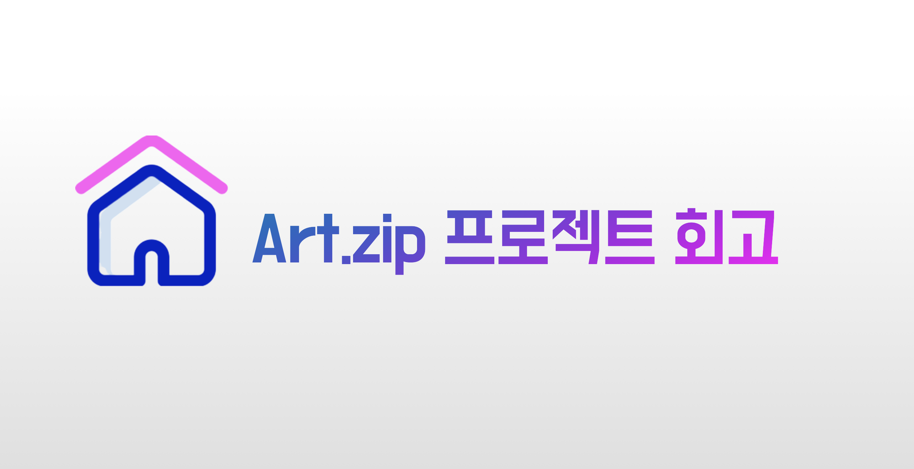

프로그래머스 데브코스 최종프로젝트로 진행한 artzip에 대한 회고이다.

사실은 현재까지도 리팩터링이 계속 진행되고 있는 프로젝트라서,
리팩터링까지 마치고 나서 회고를 작성하고 싶었으나
프로젝트 기간 내로 구현한 이슈 등을 아직 기억이 살아있을 때 작성해두고 싶으므로
이 회고의 시점은 리팩터링 들어가기 전의 시점까지의 회고이다.

## 프로젝트 일지

[[artzip] 20220718 프로젝트 일지](https://dar-jeeling.github.io/Project/20220718-%ED%94%84%EB%A1%9C%EC%A0%9D%ED%8A%B8-%EC%9D%BC%EC%A7%80/)

[[아트zip] 프로젝트 일지, TIL](https://dar-jeeling.github.io/Project/%EC%95%84%ED%8A%B8zip-%ED%94%84%EB%A1%9C%EC%A0%9D%ED%8A%B8-%EC%9D%BC%EC%A7%80-TIL/)

## 프로젝트 외부 링크

[GitHub - 🏠 ArtZip, 세상 모든 전시회를 한 번에](https://github.com/prgrms-web-devcourse/Team-BackFro-ArtZip-FE)

~~[아트집(Art.zip)](https://artzip.shop/)~~ (현재 서버 닫힘)

## 프로젝트를 진행하기 전에

데브코스의 최종 프로젝트는 데브코스 프론트엔드 과정을 수강하고 있는 사람들 \+ 백엔드 과정을 수강하고 있는 사람들을 한 팀으로 맺어서 프로젝트를 진행하는 것이다.

### 주제 정하기

프로젝트를 하면서 알게 된 건데, 프로젝트 주제를 정할 때 주제 자체가 특별(하면 좋겠지만) 한 것 보다는

**1\. 우리가 사용하는 기술 스택과 잘 어우러지고 2. 많은 것을 시도해 볼 수 있는 프로젝트를 만들어본다** 는 것에 더욱 의의가 있다는 것을 알게 되었다.

최종적으로 결정된 우리의 주제는 **"공공 API를 활용하여 전시회의 정보를 알 수 있고, 후기를 공유할 수 있는 플랫폼"** 이였는데,

주제 자체가 독특하고 재미있는 건 아니지만, 이 주제는 위의 1\. 과 2.의 조건을 잘 충족하는 주제이다.

#### **1\. 우리가 사용하는 기술 스택과 잘 어우러지고**

프로젝트 이전까지 우리 팀은 `NextJS`를 사용하기로 하였고, 공식문서를 매일매일 읽는 스터디를 진행하였다. 따라서 `NextJS`를 필두로 하는 프로젝트를 만드는 것을 계획하였다.

우리의 주제는 그런 `NextJS`와 잘 어우러진다. 왜냐하면 전시회의 정보 전달이라는 측면에서 SEO 가 중요하게 여겨지므로, SSR 방식을 차용할 필요가 있으며, 후기를 공유한다는 기능이 있다는 점에서는 사용자와의 interaction이 중요하고, 개인적인 내용이 될 수 있으므로 상대적으로 (개인정보 보호 차원에서) SEO의 중요성이 떨어지므로 CSR 방식을 차용할 수 있다.

이러한 주제의 특성을 생각해보면 `NextJS` 의 핵심적인 기능 중 하나인,

**프레임워크에서 제공하는 다양한 렌더링 방식(SSR, SSG, CSR)을 사이트의 특성에 따라 알맞게 사용할 수 있다.**

를 잘 활용할 수 있을 것 같았다.

#### **2\. 많은 것을 시도해 볼 수 있는 프로젝트를 만들어본다**

그리고 이 후 단락에서도 이야기하겠지만 `NextJS`를 제외하고도 여러가지 기술 스택이나 패턴들을 차용할 수 있는 주제이다.

조금 방대할 수도 있지만 "전시회"라는 큰 틀을 가지기 때문에 주제와 어울리는 다양한 기능이나 최적화를 생각해볼 수 있다.

예를 들면, 우리가 사용하는 데이터인 전시회 공공 api만 보고서도 다음과 같은 생각을 할 수 있었다.

" **공공 API로 가지고 오는 전시회와 관련된 다양한 데이터를 프론트단에서 어떻게 사용자에게 보여줄 수 있을까?"**

→ 해당 API에는 위치 정보를 주기 때문에 이 위치 정보를 활용하여 지도를 보여줄 수 있지 않을까?

→ 전시회의 포스터는 전시회와 관련하여 아주 중요한 부분인데 사이즈가 너무 크다! 이 큰 사이즈의 이미지를 최적화 할 수 있는 방법이 있을까?

→ 이런 정보의 경우, 사용자와 interaction 이 상대적으로 적기 때문에 SSR, SSG 나 캐싱을 활용할 수 있지 않을까?

## 도전해봤던 것들

이번 프로젝트의 가치를 한 단어로 표현해보면 "도전"이라고 할 수 있다.

부작용이 없었던 것은 아니지만 여러가지를 도전해볼 수 있었고 이 도전을 통하여 특히나 많은 것들을 배울 수 있었다.

### 다양한 기술 스택 사용하기

프로젝트를 진행하면서 다양한 기술 스택을 사용할 수 있었다.

다행이게도, 팀원들이 다들 새로운 기술 적용에 대해서 열려있는 태도를 가지고 계셨기 때문에 프로젝트에 기술스택들을 재미있게 사용할 수 있었다.

아래는 프로젝트를 하기 위해서 새롭게 채용한 기술 스택들이다.

#### [NextJS](https://nextjs.org/)

주제를 선정하기 전에 선정한 기술 스택이다. 위에서 언급했듯이, 개인적으로는 주제를 선정할 때 해당 프레임워크를 잘 활용할 수 있는지가 큰 지분을 차지하였다.

`NextJS`에서 제공하는 렌더링 방식들 외에도 프레임워크라는 특성에서 얻을 수 있는 협업의 용이성이나,  그 외 제공하는 다양한 기능들 (Image Optimization, routing) 을 활용하여 `NextJS`의 기능을 최대한 이용할 수 있었다.

#### [TypeScript](https://www.typescriptlang.org/)

Type 을 통해 얻을 수 있는 컴파일 타임에 에러를 잡을 수 있거나, 배포 단계에서 나타나는 타입 관련 문제 (api 응답값이 `null`이나 `undefined`가 들어오는 경우)를 방어할 수 있었다.

의외로 `TypeScript`를 사용함으로써 백엔드와의 협업에서도 이점을 얻을 수 있었는데,

API 명세서 필드값을 `typescript`의 `interface` 로 미리 만들어두어 복잡한 api 명세의 필드 값들을 미리 선언하고 사용함으로써, `TypeScript` 가 지원하는 코드 자동완성, 타입 추론과 같은 개발에 편리한 기능들을 이용할 수 있었다.

#### [Recoil](https://recoiljs.org/)

시간의 부족으로 `Recoil`을 제대로 활용하지는 못하였지만, 전역 유저 상태의 관리와 그 외 몇몇 컴포넌트가 공유하는 상태를 `atom`으로 만들어, 그 상태가 업데이트 되었을 때 불필요한 렌더링이 일어나는 것을 방지하기 위하여 사용하였다.

특히나 몇몇 컴포넌트가 공유하는 상태를 `atom` 으로 만드는 아이디어는, 예전에 1기 선배님과 이야기를 하면서 생각해본건데 그 분은 모달의 상태를 `conetxt api`를 이용하여 작은 `context`를 만들어서 관리한다고 하셨다. 나 또한 이를 차용하여 각 게시글의 댓글과 같은 부분을 작은 `atom`으로 만들어서 관리하려고 하였으나 (실제로도 `props drilling`과 상태를 위로 넘겨주기가 아주 빈번하게 일어나는 컴포넌트 였기에, 완성된 코드의 상태가 아주 복잡하였다) 게시글 하나하나의 댓글 상태를 전역으로 가지고 있기 위한 로직의 복잡성과 이 값을 전역으로 관리해서 얻는 이점이 애매한 것 같아서 활용하지 않았다.

따라서, 현재 로그인한 유저의 상태만을 관리하기 위하여 `Recoil`을 사용하게되었다.

#### [SWR](https://swr.vercel.app/ko)

`NextJS` 공식문서 중 Data fetching 파트를 읽으면서, `NextJS`에서 CSR을 활용할 때는 `SWR`를 사용하는 것을 추천한다는 내용을 보고 채택하였다.

SWR는 러닝커브가 낮다고는 하지만, 어쨌던간에 어느정도 이해가 필요한 라이브러리였기 때문에 프로젝트 정규 기간에는 거의 활용하지 못하였고 현재 리팩터링을 진행하면서 CSR 부분을 하나씩 마이그레이션 하고 있다.

#### [MSW](https://mswjs.io/)

> [Mocking으로 생산성까지 챙기는 FE 개발 | 카카오엔터프라이즈 기술 블로그](https://tech.kakao.com/2021/09/29/mocking-fe/)

모던 자바스크립트 딥다이브 스터디를 함께 하는 팀원이 추천해주셔서 활용하게 된 라이브러리이다.

개인적으로 백엔드에게 API를 받기 전에 더미데이터를 활용하여 UI를 만들 때, 실제 서버와 통신하는 코드를 작성하지 않고 오로지 더미 데이터만 사용한다는 찝찝함이 있었는데, `MSW`를 통하여 Data Mocking 으로 백엔드가 구현이 되지 않았음에도 더미 데이터를 실제 서버 통신하듯이 사용할 수 있다는 점이 좋았다.

`MSW`를 활용하겠다고 마음먹은 가장 큰 이유는 `NextJS`를 사용함에도 있었는데, `NextJS`의 `getServerSideProps` , `getStaticProps`를 사용함에 있어서 실제 데이터를 가져오는 부분을 미리 구현하는게 좋겠다는 생각이였다.

#### [Vercel](https://vercel.com/)

이를 채택하게 된 것에 대해서는 우선 `nextJS`가 `vercel`에서 만들었다는 이유도 있었지만, vercel을 사용하였을 때 사용한 PR들에 vercel bot이 자동으로 preview 배포를 해주는 점이 마음에 들었다는 점도 있었다. 이는 배포 환경에서의 동작 테스트를 할 때 특히나 유용하게 사용할  수 있었다.

그리고 우리 프로젝트는 `getServerSideProps` 나 `getStaticProps`를 활용하는 페이지가 그렇게 많지 않으므로 (애초에 페이지가 많이 존재하지 않음) vercel을 이용하기에 큰 문제는 없다고 생각하였다.

### 아토믹 디자인 패턴 사용하기

이전의 프로젝트에서 "컴포는트를 분류한 기준이 모호하다"라는 피드백을 받은 후, 좀 더 체계적인 컴포넌트 디자인 패턴을 사용해보고 싶었고, 따라서 **아토믹 디자인 패턴** 을 사용하였다.

아토믹 디자인 패턴을 공부하면서도 `molecules`와 `organisms`의 분류가 애매하다고 생각하였는데, 이 분류기준에 대해서는 [아래의 아티클](https://kciter.so/posts/effective-atomic-design) 이 도움이 되었다.

아토믹 디자인 패턴을 사용함으로써 컴포넌트를 더욱 명확하게 나누고, 컴포넌트의 역할과 재사용성에 대해서 잘 생각해볼 수 있었다.

### Github 주도 개발하기

이 전의 LUVOOK 프로젝트에서는 소통 툴의 실시간성에 따라서 다양한 소통 방식을 활용하였다. 하지만 툴이 많을 수록 복잡성도 높아지고, 정보가 파편화되므로 이번에는 최대한 Github의 기능을 사용해보기로 하였다.

내가 생각하는 Github 주도 개발의 핵심은 **"코드와 관련된 부분은 코드와 가까운 곳에서 이야기하기!"** 이다.

가장 인상 깊었던 부분은 `Projects` 와 `Discussions` 을 활용한 것이었다.

Projects 활용하기

`Project`를 활용하여 Notion에 코드 상태에 따라서 수동으로 진행 상태를 옮기지 않고, 깃헙 안에서 자동으로 해당 PR의 진행상태가 옮겨질 수 있다는게 아주 편리하였다.

특히나, 이러한 코드의 진행 상태의 경우 코드와 가까이 있는 곳에서 확인할 수 있는게 좋은 방식이라고 생각하기 때문에 애자일 방식에서 `Github Projects`는 개발자에게 좋은 툴이라고 생각한다.

Discussions 활용하기

`Discussions` 역시 위에서 언급한 "코드와 관련된 논의는 코드와 가까운 곳에서 하자"라는 생각에서 `Discussions`을 통하여 개발 관련 안건을 논의하기로 하였다. 마찬가지로 Github 내부에서 개발과 관련된 부분을 한 번에 모아볼 수 있었기에 편리하게 사용할 수 있었다.

## 반성해야 할 점

프로젝트는 다양한 라이브러리와 프레임워크를 적용하고 백엔드와의 협업을 통하여 괜찮은 완성도를 가진 프로젝트를 진행할 수 있었지만, 몇 가지 반성해야 할 점들이 있었다.

### 라이브러리, 프레임워크의 동작 방식에 대한 이해

프로젝트를 하면서, 어떤 라이브러리나 프레임워크를 사용하기 위해서는 사용법 뿐만이 아니라 이것들이 어떻게 동작하는지를 잘 이해해야한다는 점이였다.

#### 서버사이드 렌더링과 인증

> [Next.js: Using HTTP-Only Cookies for Secure Authentication - Max Schmitt](https://maxschmitt.me/posts/next-js-http-only-cookie-auth-tokens/)

이는 특히나 `NextJS`를 사용하여 서버사이드 렌더링을 도입하면서 더욱 뼈저리게 느꼈다. 서버사이드렌더링도 처음 사용해보았고, 그 안에서 인증을 구현하는 것도 처음이라서 `React` 의 CSR 방식의 인증만 생각하였던 것이 화근이였다.

처음에는 가장 익숙한 방식인 `Access Token` 을 `Local Storage` 에 저장하고 `Refresh Token` 을 `Cookie` 에 저장하는 방식을 사용하려고 하였으나, 백엔드 단에서 구현해주신 인증 여부가 달려있는 API를 SSR 방식으로 불러와서 사용하기 위해서는 먼저 서버에서 데이터를 불러오는 과정에서 토큰 정보가 필요하였고, 이는 서버에서 일어나는 일이므로, `Local Storage`에 접근할 수 없었다.

따라서 이 후에는 `Acess Token`과 `Local Storage`를 모두 쿠키로 저장하기로 하였는데.. 이게 개발 서버에서는 잘 작동하였으나 배포한 페이지에서는 새로 고침하면 쿠키가 날아가버려서 로그인에 대한 정보가 날아가버리는 현상이 발생하였다.  이를 해결하기 위해서 여러가지 자료를 찾아보았으나, 이는 본질적인 인증 방식을 바꾸지 않는 한 해결하지 못할 것 같다.

이 이슈에 대해서 조금 더 자세히 이야기 하자면, 현재 우리 인증방식의 경우

**로그인을 한다 → 로그인을 하면 응답값으로 body 에 토큰을 받는다. → 이 토큰을 쿠키에 저장하고 있다가 → 인증이 필요한 경우, 이 쿠키를 header에 setCookie 방식이 아니라 쿠키에 저장된 정보를 다시 header의 accessToken에 설정한다.**

의 방식으로 되어있는데, 보통 vercel 에서 사용하는 경우, 배포 시 내부에서 쿠키를 자동으로 setCookie 해주는 방식을 사용하는 것 같다.

(22.10.13)

현재 시점에서는 해결하였다!

간단하게만 작성하자면 배포에서 쿠키를 확인할 수 없었던 이유는 react-cookies 라이브러리 때문이였고, (react-cookie 라이브러리로 해결), 그 외 서버와 클라이언트의 상태가 일치하지 않아서 발생했던 문제들은 RecoilRoot의 initialState를 이용하여 해결하였다.

- 해결 방법

> [Recoil과 Cookie를 이용한 Next.js의 SSR 환경에서 전역 인증 관리하기 (JWT 토큰, 새로 고침 유지)](https://dar-jeeling.github.io/Technical/Recoil%EA%B3%BC-Cookie%EB%A5%BC-%EC%9D%B4%EC%9A%A9%ED%95%9C-Nextjs%EC%9D%98-SSR-%ED%99%98%EA%B2%BD%EC%97%90%EC%84%9C-%EC%A0%84%EC%97%AD-%EC%9D%B8%EC%A6%9D-%EA%B4%80%EB%A6%AC%ED%95%98%EA%B8%B0-JWT-%ED%86%A0%ED%81%B0-%EC%83%88%EB%A1%9C-%EA%B3%A0%EC%B9%A8-%EC%9C%A0%EC%A7%80/)

### 코드는 바로바로 정돈하기

아토믹 디자인 패턴을 사용하면서 컴포넌트의 재사용성과 역할에 대해서 잘 고민할 수는 있었으나, 위계 질서를 살리기 위하여 `atoms`, `molecules`, `organisms`, `templates` 에서 각각 따로 컴포넌트를 export 하도록 설정하였는데, 이 방식이 코드의 복잡성을 증가시켰다. 예를 들어서 `atoms`, `molecules`, `organisms`, `templates` 에서 컴포넌트를 하나씩만 import 해도 코드의 최상단에 무려 4줄이나 추가되는 것이다. 또한 컴포넌트를 가져올 때마다 이게 어디있었던거지... 하고 생각해보는 비용도 추가되었다. 따라서 컴포넌트의 경우, 모든 컴포넌트를 export 하는 index를 만들고 위계에 따라서는 주석을 넣는 방식을 사용하는게 후에 코드를 깔끔하게 정돈하기에 유리하다고 생각되었다.

그리고, alias 설정의 경우 nextJS에서 기본적으로 제공되는 것 외에도 여러가지로 alias를 적용하여 절대경로로 경로 표시를 할 수있는 부분이 있었는데 개발 일정이 워낙 빡빡하다 보니 뒤로 미루다가 결국 적용하지 못하고 코드의 경로 표기들이 지저분해졌다... 코드는 이때다 싶을 때 바로바로 정돈하는 것이 후의 비용을 줄이는 일이라는 것을 다시 한 번 느낄 수 있었다.

### 공통 컴포넌트와 UI 라이브러리

프로젝트에서 공통 컴포넌트를 만들기 위한 비용을 줄이기 위하여 `antd` 를 도입하였는데, ui 라이브러리를 도입하였음에도 공통적으로 사용할 컴포넌트가 많았고, ui 라이브러리에서 꺼내쓰는 컴포넌트 역시 커스텀이 필요한 경우가 많았다.

생각해보면 당연한게 UI 라이브러리는 극히 base 적인 부분만을 제공하므로 사용하는 쪽에서는 이를 활용하는 것이다. 아토믹 디자인 적으로 이야기하자면 `atom` 의 base 만 제공하고 그 이후는 개발자가 만들어야 한다. 예전에 UI 라이브러리에 대해서 멘토님과 이야기 했을 때도, `antd` 와 같은 UI 라이브러리를 사용하더라도 어짜피 다 커스텀해야 한다고 말씀하셨는데 바로 이 말이였던 것 같다.

따라서, Figma로 와이어프레임 기획을 하면서 공통 컴포넌트에 대한 논의를 함께 해야겠다고 생각하였다.

### 소통에 대한 이야기

특히나 소통이 중요한 우리 프론트엔드에게는 소통에 대한 이야기를 빼 놓을 수 없다. 이 소통이라는 점에서 매력을 느껴 프론트엔드 개발자를 지망하게 되었으나, 프로젝트 기간 동안의 나의 모습을 생각해보면 소통에 대한 태도가 미흡했던 것 같다.

#### 빡빡한 일정과 너무 많은 라이브러리들

일정은 매우 빡빡했지만, (특히 나의) 욕심이 너무 과했던 탓에 너무 많은 라이브러리들을 차용하게 되었고 라이브러리들을 온전하게 활용하기 어려웠으며, 라이브러리를 활용하는 것 때문에 기능 개발에 있어서 더 많은 시간을 쓰게 된 것 같다.

또한 논의를 하는 동안에도 팀원 분들이 부담을 느끼는 것 같았는데, 너무 내 욕심을 밀어 붙인게 아닌가...싶다. 게다가 처음부터 리팩터링을 염두해두고 있기 때문에, 프로젝트 기간에는 익숙한 것들을 통하여 조금 더 편하게 개발을 하였으면 불필요한 소모가 없지 않았을까? 라는 생각이 든다.

#### 다른 사람의 작업에 대한 존중

팀원 분이 이야기 하셨던 내용 중에 " **다른 사람의 작업에 대한 존중"** 이라는 말이 아주 기억에 남는다. 특히나 백엔드와 함께 협업을 할 때, 프론트엔드 측에서는 백엔드의 일을 잘 모르고 백엔드 측에서는 프론트엔드의 일을 잘 모르기 때문에 의견 충돌이 잦게 발생하였다. 특히나 타 직군을 대할 때는 내가 말하는 내용을 타 직군이 모를 수도 있다는 생각과 타 직군이 말하는 내용은 그들 나름의 이유가 있다는 것을 계속 생각해야 한다는 것을 깨달을 수 있었다.

이는 프론트엔드 팀원분들과 백엔드 팀원 분들의 논의에서 나왔던 이야기지만, 비단 다른 직군 뿐만이 아니라 팀원에게도 적용되야 할 내용이다. 앞으로는 더 부드러운 태도로 다른 사람의 작업을 존중하고 있음을 드러내야겠다고 느꼈다.

## 맺으면서

초등학생 때 마x크래프트 하던 경력을 살려 게더를 열심히 꾸몄다. (배너디자인 : 윤정님)

여러모로 배운 점이 많았고, 리팩터링을 하면서도 계속 배운 점이 생기는 프로젝트 였다. 물론 언젠가는 리팩터링 마저 끝나는 시점이 오겠지만 프로젝트를 하면서 더욱 많은 것들을 배우고 싶다.

프로젝트를 함께 진행해준 12팀 팀원 분들과, 많은 도움을 주신 S 멘토님에게도 감사함을 표한다.
