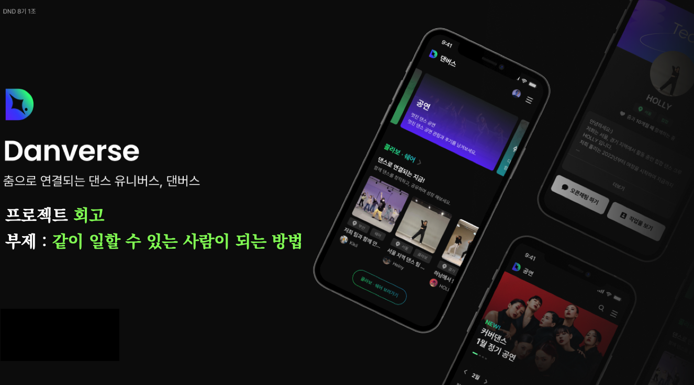
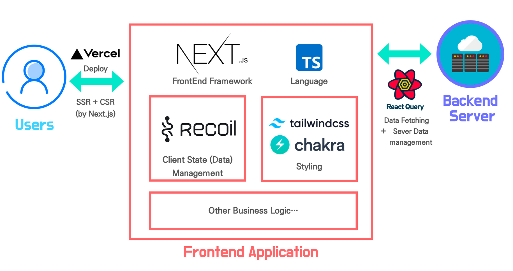
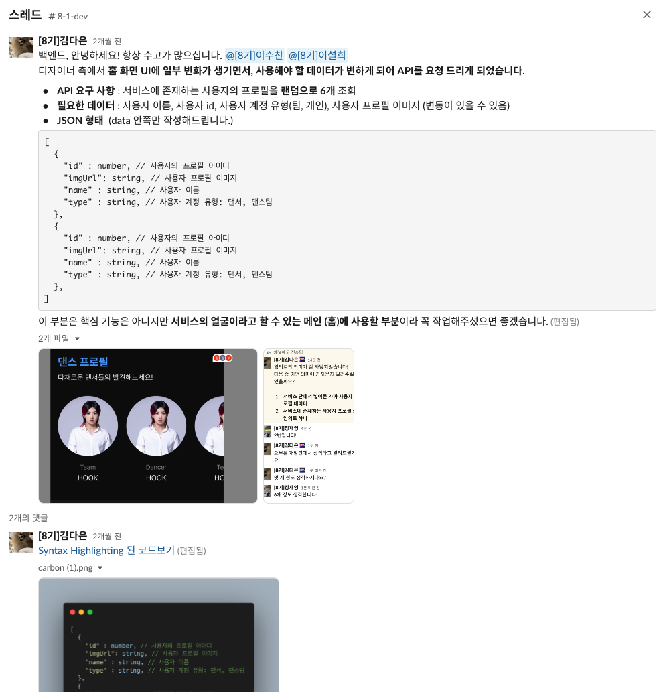
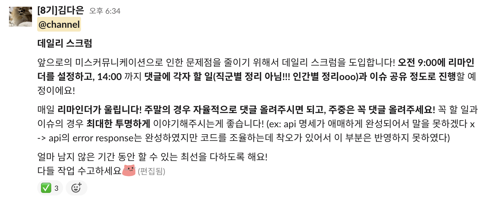
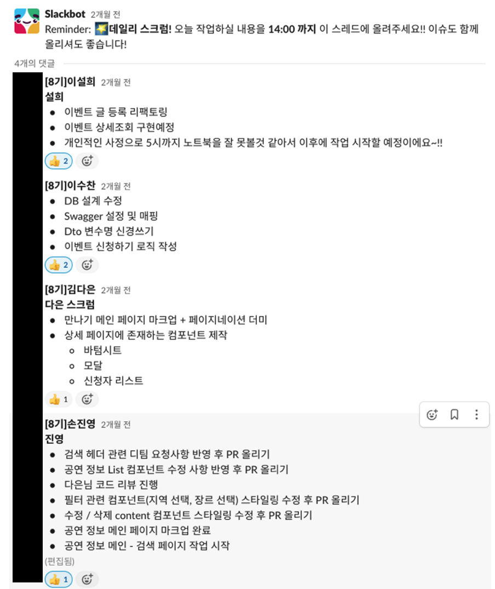

## Table Of Content

> 이 글의 길이는 매우 깁니다. 따라서, 원하는 부분을 찾아갈 수 있는 목차를 제공합니다.

- [들어가면서](#들어가면서)
- [프로젝트 개요](#프로젝트-개요)
- [주요 기술 스택 및 선정 이유 / 사용 후기](#주요-기술-스택-및-선정-이유--사용-후기)
- [프로젝트 과정에서 겪었던 어려움 및 도전: 팀워크와 협업에 대해서](#프로젝트-과정에서-겪었던-어려움-및-도전-팀워크와-협업에-대해서)
  - [소통의 방식은 도구보다 사람을 먼저 고려해야 한다.](#소통의-방식은-도구보다-사람을-먼저-고려해야-한다)
  - [백엔드 개발자와의 소통](#백엔드-개발자와의-소통)
- [프로젝트에서 얻은 기술적 인사이트](#프로젝트에서-얻은-기술적-인사이트)
  - [백엔드에서 프론트엔드에 쿠키를 직접 설정하는 방식으로 인증 구현하기](#백엔드에서-프론트엔드에-쿠키를-직접-설정하는-방식으로-인증-구현하기)
  - [React-query와 SSR 함께 사용하기](#react-query와-ssr-함께-사용하기)
- [앞으로 개선할 점과 계획](#앞으로-개선할-점과-계획)
- [마무리와 감사의 말씀](#마무리와-감사의-말씀)

## 들어가면서

 

처음에는 회고의 작성에 대해 고민을 많이 했었다. 이 프로젝트를 하면서 심적으로 고생을 많이 했었고, 더불어 프론트엔드 분야에 대해서, 개발에 대해서 까지 많은 생각이 들었다. 그래서 프로젝트가 끝난지 시간이 흘렀음에도 불구하고 프로젝트를 되돌아 볼 용기를 낼 수 없었다.

하지만 지금 시점에서 이 프로젝트를 되돌아보면, 이 프로젝트는 나의 *이정표*가 되어준 프로젝트였다. 나의 모든 프로젝트 중 가장 ‘소통’에 관하여 많은 고민을 한 프로젝트였고, **처음으로 개발적인 부분 보다 비개발적인 부분을 발전시킬 수 있던 프로젝트였다.**

즉, 이전까지의 프로젝트에서는 **기술적인 면**에 집중을 했다면, 댄버스 프로젝트는 기술적인 면보다 **같이 일할 수 있는 사람이 되는 방법**을 배울 수 있었다.

## 프로젝트 개요

<figure>

<figcaption class="caption">프로젝트 미리보기</figcaption>
</figure>

|            |                                                                                               |
| ---------- | --------------------------------------------------------------------------------------------- |
| **이름**   | 🪩춤으로 연결되는 댄스 유니버스, 댄버스💫                                                      |
| **기간**   | 2023.02.06 - 2023.03.04                                                                       |
| **인원**   | 프론트엔드 2, 백엔드 2, 디자이너 2                                                            |
| **목표**   | 춤을 추는 댄서/댄스팀을 위한 서비스로, 온오프라인 경계 없이 댄스로 연결될 수 있는 댄스 플랫폼 |
| **Github** | https://github.com/dnd-side-project/dnd-8th-1-frontend/                                       |

이 프로젝트는 사이드 프로젝트 동아리 DND에서 진행했던 프로젝트로 춤을 추는 댄서/댄스팀을 위한 서비스로, 온오프라인 경계 없이 댄스로 연결될 수 있는 댄스 플랫폼이다. 프로젝트 주제는 각 팀원이 제시한 주제 내에서 투표로 정해졌다.

나는 프론트엔드 개발의 역할을 맡았으며, 프론트엔드 팀에서는 일정 관리와 이슈에 대한 결정권을 가진 프론트엔드 팀장룰을 맡았고 개발팀에서는 백엔드와의 소통을 주도하는 역할을 하였다.

## 주요 기술 스택 및 선정 이유 / 사용 후기

<figure>
    
    <figcaption class="caption">기술 스택을 이용한 프로젝트 설계도</figcaption>
</figure>

### Next.js / TypeScript

- **도입 목적**
  - `Next.js`와 `TypeScript`의 경우, 이전의 프로젝트 (Art.zip)에서도 사용하였고 프로젝트에서 해당 기술들을 사용한 경험이 상당히 괜찮았기 때문에 또 다시 사용하게되었다.
  - 또한 같은 프론트엔드 팀원 역시 해당 기술을 가장 익숙하게 여겼기 때문에, 해당 기술에 대한 추가적인 학습 비용을 고려하지 않아도 되었기에 해당 기술을 도입하는데는 큰 부담이 없었다.
- **좋았던 점**
  - `Next.js`의 페이지 기반 라우팅과 프레임워크로써의 성격이 처음 합을 맞춰보는 프론트엔드 개발자와 개발하는데의 장벽을 줄여주었다. 오히려 동아리에서 한 작은 사이드 프로젝트였고, 실제 사용자가 별로 없었다는 특성 때문에 `Next.js`의 SSR, Image Optimization, code spilitting 과 같은 성능 적인 부분보다는 **프레임워크로써 협업을 용이하게 해준다**가 더 와닿았다.
- **아쉬웠던 점**
  - `Next.js`과 `React`의 버전업을 고려하지 않아서, 초반에 SSR 관련 오류를 잡기가 힘들었다. 특히나 이번 프로젝트에서 유달리 `Modal`, `BottomSheet`와 같은 `Portal`을 이용하는 컴포넌트를 많이 만들었는데 `React`의 버전 업에 따른 “서버 컴포넌트” 의 특성을 초반에 파악하지 못해 `window is not defined` 에러를 만나고 말았다.
  - 위에서 추가적인 학습 비용이 없을 거라고 생각하긴 했었지만… 그럼에도 불구하고 초반에 프론트엔드 개발에서 붕 뜨는 시간을 이용해서 팀의 개발자와 함께 사용하는 기술 스택에 대해서 전반적으로 점검하면서 서로 아는 부분과 알지 못하는 부분을 체크하고, 새로운 버전에 대해서 학습하는 시간을 가졌으면 좋았을 것 같다.
  - 마찬가지로, 이를 고려하지 못해서 `React`의 `Suspense`나 `Error Boundrary`와 같은 기능을 사용하지 못한게 아쉽다. 특히 우리 프로젝트는 SSR 뿐만이 아니라 **CSR로 로딩하는 부분도 상당히 많았으며 서버가 불안정한면이 있었기 때문에**, 서버가 불안정하다면 우리 앱도 얄짤없이 해당 부분이 blocking 되면서 UX가 안좋아졌었는데, Suspense나 Error Boundary를 사용하였으면 이런 부분을 프론트엔드 측면에서 조금이나마 개선할 수 있지 않았을까? 라는 생각이 든다.

## Recoil

- **도입 목적**
  - 전의 프로젝트에서 Recoil을 도입하였음에도 제대로 사용하지 못했던 아쉬움도 있었고, 위의 기술 스택과 마찬가지로 팀원 모두 이미 한 번은 사용해본 적이 있는 라이브러리 + 학습 비용이 낮다 는 장점으로 프로젝트 기간에 학습 비용을 줄이고자 선택하였다.
- **좋았던 점**
  - 학습 비용이 낮았던 만큼 코드를 작성하는데도, Recoil을 사용하지 않은 팀원이 코드를 읽는 데도 크게 어려움이 없었다.
- **아쉬웠던 점**
  - Recoil을 도입한 것 까지는 좋았으나, 나와 팀원 모두 **전역 상태 관리에 대한 근본적인 이해가 부족하였다.** Modal이나 BottomSheet와 같은 컴포넌트의 경우 Recoil을 사용하여 전역 상태로 구현하는게 코드 퀄리티나 개발자 경험에서도 좋았을 것 같은데 프로젝트를 개발하면서는 이들을 전역 상태로 구현하는게 당장은 복잡해보였고, 이는 스노우볼처럼 굴러가 코드를 복잡하게 만드는 주 원인이 되었다.
  - 결국에는 Recoil을 사용한 부분이 인증로직 밖에 없는데, 인증 로직 뿐이라면 사실 Context api로 충분히 대체가 가능하다. (물론 그 아래에 있는 컴포넌트들이 모두 리렌더링되긴 하지만, 앱의 정합성 측면에서는 오히려 아래에 있는 컴포넌트들이 리렌더링 되는 것도 나쁘지 않다.)

### React-Query

- **도입 목적**
  - 예전의 프로젝트에서 비슷한 기술 스택인 `swr` 을 활용해서 큰 성능 개선을 이룬 것을 보고 해당 라이브러리에 흥미를 느꼈는데, 마침 같은 팀원이 `react-query`를 사용할 것을 강력하게 주장하여서 도입하게 되었다.
- **좋았던 점**
  - `react-query`의 주요 도입 목적인 **서버 상태를 전역적으로 관리할 수 있으며, 클라이언트와 분리한다**라는 컨셉에 대해서 배울 수 있었다. 특히나 서버와 클라이언트를 분리해서 서버의 상태는 `react-query`에 위임한 라이브러리의 설계를 보고 개인적으로도 CS에서 가장 중요하다고 생각하는 **추상화**의 개념이 와닿았다. (컴포넌트를 만들 때 **데이터와 뷰의 분리**에서 데이터를 불러오고, 처리하는 로직을 custom hook으로 빼놓는 코딩 스타일을 권고하는 글이 많았는데, `react-query` 도 이러한 개념에서 출발하지 않았을까? 라는 생각이 들었다.)
  - 또한, 항상 상태 관리 라이브러리에 대해서 redux랑 비교하고, 비동기 이야기를 많이한 부분이 개인적으로는 정말로 이해가 가지 않았는데 `react-query`를 통하여 서버 상태를 전역적으로 관리하면 얻을 수 있는 이점을 체험하고 나니 **왜 전역 상태를 서버로 관리하려고 하였으며, redux를 비롯한 많은 라이브러리들에서 그동안 비동기 처리를 해결하려고 하였는지** 이해가 되었다.
  - 러닝커브가 아예 없다고는 못하겠으나, 이전의 기술 스택에서 벌어 놓은 학습 시간이 있어서 프로젝트 기간 동안 `react-query`의 일부를 학습하는데는 크게 문제가 없을정도였다. 또한 프로젝트와 함께 진행하고 있던 **HTTP 완벽 가이드 스터디**와 서버 상태 관리에 관한 내용이 적절한 시너지를 일으켜서, 해당 라이브러리에 대해서 잘 이해할 수 있었다.
- **아쉬웠던 점**
  - 아무래도 처음 쓰는 라이브러리다 보니 숙련도가 부족한 면이 있었다. 초반에 이를 사용하는 코드는 팀원 분이 대부분 작성해주셨는데, 나도 그 코드를 많이 참고하여서 해당 코드에 대한 제대로 된 리뷰를 (초반에는) 많이 드리지 못해서 죄송했다.

### Storybook

- **도입 목적**
  - 컴포넌트의 문서화와 리뷰어의 컴포넌트 테스트를 위해서 도입하였다. 또한 디자이너와 함께 하는 프로젝트이기 때문에 스토리북을 배포하고, 이를 디자이너가 직접 컴포넌트를 다뤄보면서 피드백 받는 방식으로 진행하면 디자이너와의 소통이 원활해질 것 같았다.
- **좋았던 점**
  - 코드 리뷰를 할 때나 컴포넌트를 설계 할 때, 컴포넌트 하나에만 집중할 수 있는 점은 좋았다. 또한 `.stories` 코드를 짜면서 팀원에게 리뷰를 부탁하기 위해 여러 케이스의 더미 데이터를 만들어서 코드를 구현했는데, 이 부분에서 묘하게 수동 셀프 테스트가 되었던 것 같다.
- **아쉬웠던 점**
  - 디자인과 데이터가 너무 자주 바뀌다보니, 스토리북에서 이를 바로바로 적용하기가 힘들었고, 결국에 초기 목적 처럼 **디자이너와의 소통**에 활용하지 못하였다.
  - `storybook`과 개발 환경이 달라서, 생각 처럼 동작하지 않는 컴포넌트가 있었다. 대표적으로 포탈을 사용하는 컴포넌트나, 일부 css 속성들(이건 원인을 잘 모르겠다..)이 그래서 스토리북에서 제대로 개발을 했더라고 해도, 실제 앱에 렌더링하면 다르게 보이는 컴포넌트들이 있었다.
  - `stroybook`의 경우 컴포넌트 테스트로 지원하는 더욱 강력한 기능들이 있다고 들었다. 후술하겠지만, 우리 프로젝트에서 가장 아쉬운 점 중 하나가 **테스트의 부재**인데, `storybook`의 기능을 더 잘 알아보고 사용하였다면 좀 더 단단한 환경을 구축할 수 있지 않았을까 싶다. (특히나 코드 리뷰, 테스터가 서로 밖에 없었기 때문에 더욱 중요한 사항이라고 생각한다.)

## 프로젝트 과정에서 겪었던 어려움 및 도전: 팀워크와 협업에 대해서

### 소통의 방식은 도구보다 사람을 먼저 고려해야 한다.

지금까지 진행했던 프로젝트에서 소통 문제를 크게 겪은 적은 없었지만, 이번 프로젝트에서 처음으로 소통에 대한 문제를 경험하고, 개발 일정에 큰 영향을 미치게 되었다. 개발 팀의 경우, 나를 제외하고 모두 팀 프로젝트에 익숙하지 않은 사람들이었고 이로 인해 **`slack`**, **`notion`**, **`github`**과 같은 협업 도구 역시 익숙하지 않은 상태였다. 특히 가장 큰 문제점은 개발팀에서 나를 제외하고 모두 안면이 있는 관계였고, 프론트엔드 팀원과 백엔드 팀원은 이미 친분이 있는 상태였던 것이다.

따라서 초기에 프로젝트에 대한 소통이 친분이 있는 사람들끼리의 1:1 연락으로 이루어졌고, 요청 사항 역시 마찬가지로 **슬랙에 요청** → **슬랙의 메시지를 확인하지 않거나, 안건이 급하다고 생각해서 1:1로 연락함** → **내가 모르는 형태 + 요청과 다른 형태로 기능이 만들어짐** 의 사이클로 소통에 상당한 어려움이 생겼다.

이 문제를 해결하기 위하여, 동아리 운영진을 비롯한 데브코스에서 함께 했던 사람들에게 상담을 요청하였고 상담을 통해 느낀 점은 **프론트엔드 개발자로서 애플리케이션에 대한 소통에 적극적으로 임해야 하며, 우리 팀이 프로젝트를 무사히 끝내기 위해서는 미스커뮤니케이션을 최소화하는 것이 우선이라는 것** 이었다.

### 백엔드 개발자와의 소통

처음 백엔드 개발자와 소통이 잘 안되었을 때는 물론 (나도 사람이니까) 답답함을 느꼈지만, 어쨌든 프로젝트를 완성하기 위해서는 _함께_ 작업을 해야하는 사람들이라는 것을 깨달았다.

따라서 백엔드 개발자와 소통이 안되는 이유에 대해서 생각해보았고, 이를 해결하기 위한 방안을 모색해보았다. 그들과 소통이 안되는 이유는 다음과 같았다.

- **서로의 역할에 대한 이해 부족 → 프로젝트에서 프론트엔드의 역할에 대해서 이야기 하고, 대화로 풀어나가기**

  - 초반 미스커뮤니케이션에서 가장 답답했던 점은 백엔드가 디자이너와 화면의 데이터에 대해서 소통하거나 데이터에 대한 정의를 프론트엔드 측에서 작성한 문서가 아닌 피그마를 보면서 정의하는 거였다. (나중에 대화를 나눈 바로는, 화면을 보고 백엔드에서 알아서 데이터를 줄 생각이였다고 했다.) 이러한 문제를 해결하기 위하여 백엔드의 입장에서 생각해보기로 하였다. 앞에서 언급했다시피 백엔드 개발자의 경우, 모두 프론트엔드와의 개발이 처음이였다. 따라서 프론트엔드 개발자의 역할에 대해서 잘 이해하지 못하는 상황이였으며 특히 API 명세와 JSON 형식 정의가 왜 중요한지에 대해서 잘 이해를 하지 못하였고, 백엔드 역시 프론트엔드 측의 일방적인 요청에 대해서 피로를 느끼는 상태였다. 이를 해결하기 위해서 백엔드 개발자에게 **프론트엔드 개발자의 역할에 대한 이해**를 말씀드리는게 우선이였고 이를 위해 **나 자신 먼저 프론트엔드 개발자에 대한 이해를 하는 것이 우선이였다.**
  - 이를 위해 여러 사람들에게 프론트엔드 개발자의 역할과 다른 직군의 사람들과의 협업 프로세스에 대해서 도움을 요청하였다. 가장 와닿았고, 백엔드에게 꼭 해줘야할 것 같은 말은 **프론트엔드 개발자는 애플리케이션의 첫 번째 유저**라는 것이였다. **프론트엔드 개발자는 첫 번째 유저임과 동시에 개발자이기 때문에 디자이너와 UI/UX 수정사항을 논의하고, API 명세나 수정사항 그리고 필요한 API를 적극적으로 요구해야 한다는 것이다.**
  - 미스커뮤니케이션의 기간이 길었기 때문에, 서로의 감정 역시 상한 상태였기에 백엔드 팀원들에게 1대 1로 프론트엔드 개발자의 역할에 대해서 말씀드리고 API 명세가 늦어지고 지금까지 미뤄진 이유에 대해서도 이야기를 하여, 왜 API 명세가 빨리 필요하고 가급적 작업의 우선순위를 당겨달라는 설득을 하였다. 다행히 이야기를 잘 들어주셨고, 우리의 입장을 이해해주시려고 했다.

- **요구 사항에 대한 잘못된 이해 → 요구사항을 구체적으로, 객관적으로, 근거와 함께 설명하기**

  - 초반에는 요구사항에 대해서 간단하게 `...` 조회하는 API 만들어 주세요. API의 내용에는 `...`, `...`, `...`, `...`가 있었으면 좋겠습니다. 정도로만 요청했으나 **들어오는 데이터들이 프론트엔드에서 원하는 방식과 다르게 들어오는 경우가 있었다.**
  - 이를 위하여 **프론트엔드 측에서 백엔드에게 API를 요청하기 위한 형식을 정의**하였고, **최대한 구체적인 형식과 읽는 사람에 있어서 설득할 수 있을 근거와 함께 요구사항을 요청하도록 노력**하였다.
    <figure>
        
        <figcaption class="caption">백엔드에게 요구사항을 보내는 형식 실제 예시</figcaption>
    </figure>

- **전체 프로젝트의 현재 진행 방향 (큰 그림)에 대한 개발자들의 이해 부족 → 데일리 스크럼을 통하여, 서로 프로젝트의 진행 현황을 공유하기**

  - 우리 팀의 개발자들은 대부분 *학습*을 목표로 사이드 프로젝트를 진행한다. 따라서 초반에 서로 최신의 기술을 쓰고, 서로의 분야에서의 최적화에만 힘을 쏟았다.
  - 그러다보니 프론트엔드는 프론트엔드에만 백엔드는 백엔드에만 관심이 치중되는 것이 문제였다. 서로 *하나의 목표(프로젝트를 완성시키는 것)*이 아니라, 내가 만들고 있는 것에 최신의 기술을 적용하고 최고의 코드를 작성하자는 마인드 때문에 백엔드와 프론트의 작업 일정이 상당히 맞지 않았다.
  - 프로젝트를 완성하기 위해서는 _서로 내려 놓는 것_ 이 중요하였다. 이를 위해 나 뿐만이 아니라 팀원들을 설득시켜야 했다. 이를 위해서 한 분 한 분께 대화를 요청해서 현재 상황을 말씀드리고, 프로젝트 완성에 힘써달라고 부탁드렸다. 다행히도 다른 개발자 분들 모두 이해해주시고 서로의 직군에서 내려 놓을 부분을 내려 놓으면서 프로젝트 완성에 힘썼다.
  - 또한 프로젝트를 _다함께 완성시켜야 한다_ 라는 부분을 상기시키고, 서로의 미스커뮤니케이션으로 인한 문제점을 줄이기 위하여 데일리 스크럼을 도입하였다. 백엔드와 프론트엔드 팀원들의 활동 시간이 잘 맞지 않았기 때문에, slack을 이용한 비동기 소통이 적합하다고 판단하여 slack에 리마인더를 설정하고 오후 2시 까지 댓글에 각자 할 일을 공유하였다.

    <figure>
       
       <figcaption class="caption">데일리 스크럼 도입 공지</figcaption>
    </figure>

    <figure>
        
        <figcaption class="caption">데일리 스크럼 실제 진행 예시</figcaption>
     </figure>

**이러한 노력 덕분에 프로젝트의 소통 문제가 점차 개선되었고, 팀원들 간의 미스커뮤니케이션도 줄어들었다. 결과적으로 프로젝트는 원활하게 진행되어 마무리 단계에 도달할 수 있었다.**

이 경험을 통해 **개발적인 부분 뿐만이 아니라 비개발적인 부분 역시 프로젝트의 성공 여부에 큰 영향을 미칠 수 있다**는 것을 깨달았다. 앞으로 개발자로서의 커리어를 이어가면서, 소통을 개선하기 위한 노력을 게을리하지 않고 다양한 사람들과 협업할 수 있는 역량을 기르기 위해 노력해야겠다고 다짐했다.

## 프로젝트에서 얻은 기술적 인사이트

비록 개발적인 면보다 비개발적인 면에 집중한 프로젝트지만, 개발의 본질이란 기술적으로 문제를 해결하는 과정이기에 기술적인 인사이트 역시 얻을 수 있었다.
특히 이번에는 주요 환경 설정에 대한 코드를 자주 작성하게 되었는데 이를 작성하면서 구현뿐만이 아닌, 뒤에서 돌아가는 로직에 대해서 생각할 수 있었고 자동화의 중요성 까지 생각해졸 수 있었다.

### 백엔드에서 프론트엔드에 쿠키를 직접 설정하는 방식으로 인증 구현하기

> [쿠키를 이용하여 프론트엔드와 백엔드의 통신을 구현하기](https://www.allsilver.dev/Technical/쿠키를-이용하여-프론트엔드와-백엔드의-통신을-구현하기/)

- 프로젝트의 인증 구현 방식이 로그인을 하면 **백엔드에서 `set-cookie`를 통하여 직접 클라이언트에 쿠키를 설정해주는 방식** 이였다.
- 이를 구현하기 위해서, **HTTP의 Cookie에 대한 지식**을 알아야 했다. 다행히, 당시 `HTTP 완벽 가이드` 스터디를 진행하고 있었고 관련 내용의 경우 책에는 없는 최신의 내용이였으나 스터디 팀원이 공유해준 내용이었으므로 해매지 않고 빠르게 구현할 수 있었다.
- `https`를 사용하는 서버에서 클라이언트에 쿠키를 설정하기 위해서는 **현재 크롬 브라우저 기준 `SameSite` 속성의 기본값이 `None`에서 `Lax`로 변경**되었으며, `SameSite=None`을 이용할 경우 `secure cookie`를 사용하는 것이 강제되었다. 따라서 개발 환경에서 정상적인 로그인을 구현하기 위해서는 **개발 환경을 https를 사용하여 띄워야 했다.**
- 어쩌다보니 연속적으로 인증 관련 부분을 맡고 있는데, 이번 프로젝트에서 아쉬웠던 점은 **서버 사이드에서 토큰 재발행 로직이 제대로 동작하지 않는다는 것** 이였다. 시간이 없어서 해당 부분에 대해 보완을 할 수 없었는데, 이 후에서는 `next.js`의 `api`를 **서버와 서버끼리는 CORS가 없다**라는 것을 활용하여 `next.js`의 `api`를 인증 프록시 서버 처럼 활용하는 방안을 찾아볼 것이다.

### React-query와 SSR 함께 사용하기

> [React Query를 사용할 때, Next.js의 SSR에 인증 사용하기](https://www.allsilver.dev/Technical/React-Query를-사용할-때,Next.js의-SSR에-인증-사용하기/)

- 지난 Art.zip 프로젝트과 달라진 점은 SSR을 사용하면서, `react-query`를 사용해야 했다는 것이다.
- `react-query`를 이용하여 SSR을 사용할 때 `prefetchQuery`를 사용해야 했는데, **인증을 위해 추가되어야 하는 점은** 사용자 인증 정보 (토큰 정보)에 따라 api를 새로 호출해야 했었으므로 `queryKey`에 accessToken도 함께 넣어줘야 했다.
- `react-query` 에 `queryKey`를 잘 설정해야 한다는 점을 몸소 배울 수 있었다. 이번에도 진행하고 있던 `HTTP 완벽 가이드` 스터디가 도움이 많이되었는데, 스터디에서 **캐시와 관련된 내용**에서 깊게 공부할 수 있었기 때문에 `react-query`의 `queryKey`가 더욱 잘 와닿았다.
- 흔하게 프레임워크와 라이브러리를 이해하는건 **기본기**라고 한다. `react-query` 역시 클라이언트와 서버상태의 분리, 네트워크 요청 향상 이라는 목표를 위하여 **기본 자바스크립트의 요청**과 **Cache의 개념** 을 통해서 풀어나간 사례라는 생각이 들었다. 이를 통해 **모든 응용의 기초는 기본기**는 사실을 더욱 상기시킬 수 있었다.

## 앞으로 개선할 점과 계획

### 안일했던 나와의 대면

- 이 프로젝트에서 개발자로서 가장 아쉬웠던 점은, 몇몇 부분에서 개선하지 않고 예전에 만든 코드를 그대로 사용한 것이다. 이 때문에 내가 짠 코드가 이전 프로젝트에 비해 발전했냐고 묻는다면, 그렇다고 답하기 어렵다.
- **특히, 코드 작성 시 단순히 *익숙하기만*한 기술을 어느 정도 다룰 줄 안다고 착각한 것 같다.** `TypeScript`가 대표적인 예인데, `type narrowing`과 같은 코드 안정성을 높일 수 있는 기법을 충분히 활용하지 못한 것이 아쉽다.
- API 통신 로직 역시 기존의 `axios`를 사용했지만 (익숙하니까), `HTTP 완벽 가이드` 스터디에서 배운 내용을 통해 `XHR` 기반이 아닌 `fetch`와 `AbortController` 같은 web API를 사용하면 지금과 비슷한 로직을 구현하면서도 현재 웹 생태계와 더 잘 어울리는 코드를 작성할 수 있었을 것 같다.
- 자주 사용하던 라이브러리나 프레임워크의 새로운 버전이 있다면 (특히 메이저 업데이트라면) 반드시 확인해야 함을 깨달았다. 특히 새로운 버전의 `next.js`와 `React`는 **서버 컴포넌트**와 `useTransition`, `Suspense`와 같은 기능이 추가되었는데, 이 기능을 활용하면 현재 프로젝트를 더욱 안정적이고 세련되게 만들 수 있었을 것이다.

결국, 나에게 필요한 것은 **_내가 알고 있는 지식이 내가 알고 있지 않을 수도 있다_**는 점이었다. 이는 특히 프론트엔드 개발자에게 중요하다. 프론트엔드 개발은 트랜드가 빠르게 변하고 사용하는 라이브러리/프레임워크의 논리도 빠르게 바뀌기 때문에, 이전에 내가 사용하던 기술이 약간의 시간이 흘러도 그것이 아닐 수 있다는 것이다.

프로젝트를 통해 안일했던 나와 마주할 수 있었고, 이를 개선하기 위해 다음과 같은 활동을 계획하였다.

- **새로운 버전이 나온 라이브러리/프레임워크를 공식문서 기반으로 공부하기**
  - 프론트엔드 개발자에게 빠르게 변화하는 기술 트렌드와 라이브러리/프레임워크의 변화를 캐치하는 것이 중요하다. `React`와 `Next.js`는 나의 주요 기술이므로, 이들에 대한 이해와 단단한 기반을 갖추는 것이 중요하다. 따라서 주요 기술들에 대한 학습을 통해 강점을 만들어 나갈 것이다.
  - 마침 `React`의 경우 새로운 공식 문서 번역자를 모집하고 있어서, 번역자로 지원하였다. 이를 통해 오픈소스 컨트리뷰션을 할 기회가 생겼고, 공식 문서를 번역하면서 공식 문서 친화적인 개발자가 될 수 있을 것이다.
- **시간이 걸리더라도 지식과 코드에 주체적인 사고를 담기**
  - 시간에 쫒겨 빠르게 개발하려고 이전 코드를 사용하거나, 날림으로 코드를 짜는 것이 기술적 성장을 저해하였다. 그러나 이런 행동이 프로젝트에서 수많은 버그를 야기하였다. (프로젝트 마감 직전까지 이로 인한 버그를 고치느라 고생하였다.) 따라서 시간이 걸리더라도 코드 작성 후, PR 올리기 전에 셀프 코드 리뷰를 진행하거나 `Chat GPT`와 같은 AI 도구를 사용하여 **사고의 시간**을 가져야겠다.
  - 또한, 이러한 **사고의 과정**을 통해 잠재적인 버그 위험을 최소화하기 위해 **테스트 코드**의 중요성을 깨달았다. 다음 프로젝트에서는 테스트 코드를 적용하여 **내가 짠 코드에 대한 테스트 코드를 작성함으로써 코드에 대해 한 번 더 생각할 수 있는 계기를 만들고 싶다**.

### 앞으로의 협업에서는..

- 팀이 결성되었을 때, 아이스브레이킹에 시간과 정성을 들일 필요가 있다는 것을 느꼈다. 아이스브레이킹을 통해 팀과 프로젝트에 애정을 가지고, 서로 소통을 할 때 벽이 허물어져야 프로젝트에 대해 자유롭고 영양가 있는 의견을 낼 수 있다.
- 같은 포지션의 개발자와 개발을 할 때, 서로 알고있는 것과 알고 있지 않은 것에 대해서 확실히 이해하고 같은 것을 알고 있다고 해도 해당 지식이 최근에 변한게 있다면 그 부분에 대해서 스터디를 하면서 공통의 지식을 맞춰나가는 과정이 있으면 좋겠다고 생각했다.
- 초반에 개발자들끼리 프로젝트에 대해 같은 이해를 해나가는 과정이 중요하다는 것을 배웠다. 서로 사이드 프로젝트인 만큼 어떻게 최신 기술을 넣고, 코드를 최적화할 수 있을지에 대해 고민하느라 **프로젝트 그 자체에 대한 이해**에 시간을 많이 쏟지 못하여서 그 동안의 미스커뮤니케이션이 발생하였다. 앞으로의 프로젝트에서는 백엔드와 프론트엔드끼리 공통의 요구사항을 이해하는 과정을 가지고, 해당 요구사항에 대한 인지를 바탕으로 각 포지션에서 요구 사항을 정리한 후 서로 합의하는 시간을 가져 **요구사항에 대한 미스커뮤니케이션을 최소화하고 싶다.**

## 마무리와 감사의 말씀

- **개발자에게 사이드 프로젝트를 하는 이유가 무엇일까?** 솔직히 말하면, DND를 지원하면서도 충분히 바쁜데, 사이드 프로젝트를 할 여건이 있을까 라는 생각을 했고, 후회할 수도 있다는 두려움이 들었다. 프로젝트를 완성한 후에도 *이 프로젝트가 나에게 어떤 의미일까?*라는 고민을 했다. 그러나 회고를 작성하고 프로젝트에 대해 되짚어보면서 이 프로젝트가 **_나에게 이정표가 되어준 프로젝트_**라는 결론을 내릴 수 있었다.
- 서로 정말 많은 고생을 했다. 개발이 힘들었던 것도 있었지만, 앞서 언급한 것처럼 팀원들의 갈등도 있었고, 프로젝트가 끝난 후에는 나뿐만 아니라 모두가 몸과 마음이 지쳐있었다. **초반에 미스커뮤니케이션이 있었고, 감정이 상한 부분이 분명했음에도 프로젝트 완성을 바라봐주고, 몇 차례 이야기를 건넸을 때 거절하지 않고 열린 마음으로 들어주신 백엔드 개발자 분들, 디자이너와의 협업이 처음이라 협업에 미숙한 부분이 있어서 다수의 질문과 요청사항을 보냈음에도 불구하고 하나하나 정성스럽게 고민해주시고 검토해주신 디자이너 분들, 그리고 마지막으로 중간에 몇 번 목표를 수정하기도 하고 스프린트 하나하나가 미숙했음에도 같은 목표를 향해주시고 프로젝트를 발전시키기 위해 함께 밤새 노력해주신 프론트엔드 개발자 진영님에게 감사의 마음을 전한다.**
- 마지막으로, 프로젝트에서 겪은 문제에 대해 상담을 요청했을 때 **흔쾌히 상담해주고 함께 고민해주신 DND 운영진 세희님, 성준님, 동영 멘토님, 기동 멘토님, 데브코스 기간이 끝났음에도 갑작스러운 디엠에 답변해주신 데브코스 동료 승희님, 혜경님에게 감사의 말씀을 전해드리고 싶다.**
