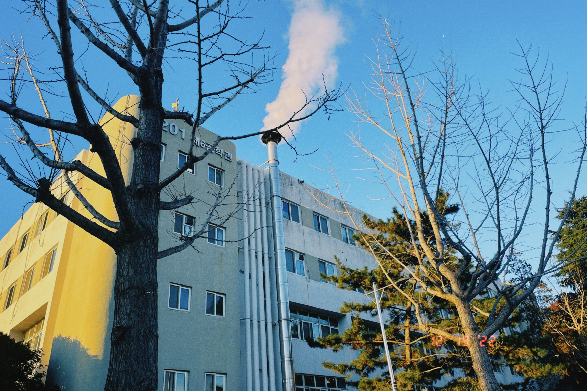
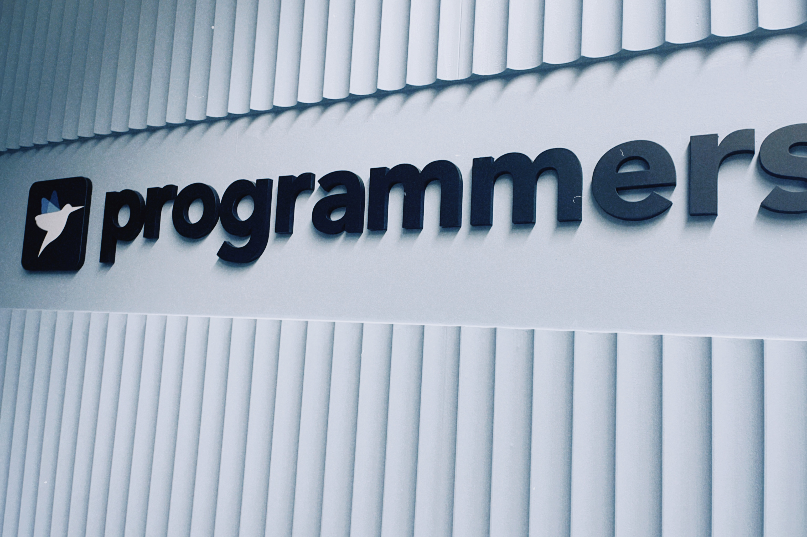
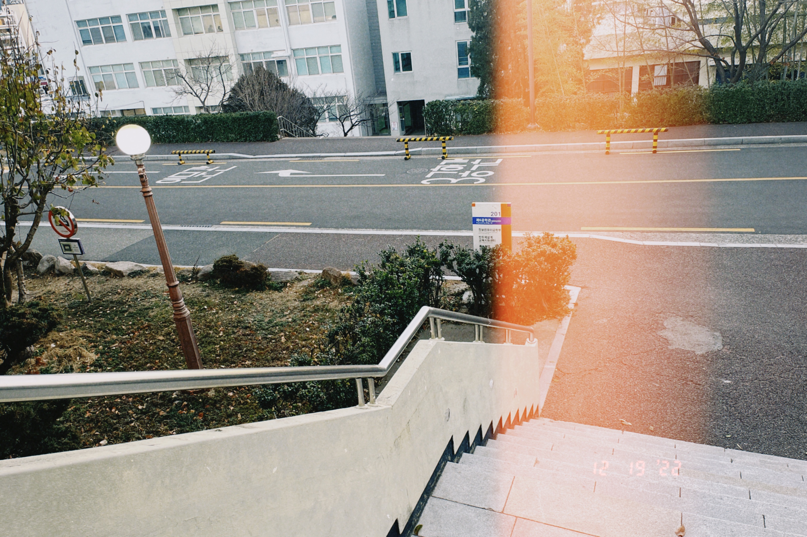

# 들어가면서

2022년을 한마디로 정의하자면 **운이 좋았던 한 해**라고 정의할 수 있을 것 같다.

굳이 자세히 언급하지 않겠지만 2021년 하반기부터 나의 감정적인 측면에서도, 능력적인 측면에서도 슬럼프에 빠져있었다. 그러나 2022년의 **어떤 행운**들 덕분에, 감히 슬럼프에서 탈출하였다는 말은 못 하겠지만 **적어도 어깨에 짐을 지고서도 나아갈 방법**을 배울 수 있었다.

2022년의 회고는 이 **어떤 행운들**에 대한 회고이다.

### 2022년의 나의 큰 줄기

- 3월 ~ 8월 : 데브코스를 통한 프론트엔드 기본기 다지기
- 9월 ~ 12월 : 학교 다녔음

# 행운들

## 행운 : 프로그래머스 데브코스

나의 2021년 하반기를 강타했던 슬럼프의 원인에 대해서 생각해보면, 단순히 길을 잃었다는 것을 넘어서 길을 잃었다는 것도 인지하지 못하는 상태였다. 여기서 가장 고통스러웠던 것은 내 상태(길을 잃었다는 것도 인지하지 못하는 상태)를 스스로 알고 있음에도 불구하고 어디로 가야할지 몰라 새로운 미로를 만들고 있었다는 것이다.

프로그래머스 데브코스의 면접은 아쉬움만 가득했던 면접이었지만 (스스로 느끼기에는) 딱 한 가지 질문 - _왜 프로그래머스 데브코스를 지원하게 되었나요?_ - 에서만은 만족스럽게 대답을 한 것 같다. 기억을 더듬어서 생각해보면, 스스로 나아가야 할 방향을 판단할 수 있는 기준을 찾고 그 기준을 통해 나아가고 싶다-와 비슷한 이야기를 하였고 면접을 넘어 교육을 수료하고 나서 몇 개월 이후에 교육받았던 과정을 돌이켜보면 **적어도 자신의 관점에서 내가 가고 있는 길을 판단할 수 있는 사람이 될 수 있던 것 같다.**

## 행운 : 해냈기 때문에 할 수 있었던 것

> [**[프로젝트 회고] ALL WE NEED IS LUVOOK**](https://www.allsilver.dev/%ED%9A%8C%EA%B3%A0/%ED%94%84%EB%A1%9C%EC%A0%9D%ED%8A%B8-%ED%9A%8C%EA%B3%A0-ALL-WE-NEED-IS-LUVOOK/)
>
> [**[프로젝트 회고] 전시회 정보를 한 번에 zip, Art.zip**](https://www.allsilver.dev/%ED%9A%8C%EA%B3%A0/artzip-%ED%94%84%EB%A1%9C%EC%A0%9D%ED%8A%B8-%ED%9A%8C%EA%B3%A0/)

개발자로써 어떤 프로젝트를 완성시킨다는 것은 할 수 있기 때문에 해낸 부분도 있겠지만 **해냈기 때문에 할 수 있었던 부분** 역시 큰 것 같다.

생각해보면 항상 나의 *개발*을 한 발자국 내딛게 해줄 수 있었던 것은 **해냈기 때문에 할 수 있었던** 경험이였다. 개발을 처음 시작할 때도, 프론트엔드 개발을 하자고 마음 먹었을 때도 그랬으며, 쉽지만은 않았던 데브코스에서 나를 버티게 할 수 있던 것도 이러한 경험 덕분이였다.

### 프로젝트를 통해서 무엇을 해냈나?

첫 프로젝트인 `LUVOOK`은 **기본기에 충실한 프로젝트**였다. 기본 컴포넌트를 단계적으로 만들어가고 해당 컴포넌트를 통해서 웹 앱을 만들고, 각 컴포넌트가 공유하고 있는 상태를 파악하고, 그 상태를 통해 전역 상태관리를 하는 과정에서 **프론트엔드 개발자의 기본 덕목이라고 할 수 있는 컴포넌트 구조에 대한 이해도**를 키울 수 있었다.

또한 이 과정에서 프로젝트 동안 구현하지 못하였던 부분이나 아쉬웠던 부분을 통하여 현대의 React 가 왜 이러한 방향으로 발전했는지(React 에서 왜 Hook 을 도입하려고 했었는지, 다양한 전역 상태 관리 라이브러리들이 왜 만들어졌는지, CSR 방식에 어떤 문제가 있었고, 그 문제를 해결하기 위해서 왜 SSR을 도입하게 되었는지) 에 대한 문제 의식을 또렷하게 할 수 있었다.

 

최종 프로젝트인 `Art.zip`는 기본에 충실했지만, 기술적으로는 아쉬웠던 `LUVOOK`에 비해서 **기술적인 측면에서 도전을 많이 하였던 프로젝트**였다. 기술적으로 도전을 많이 해봤던 만큼, 그동안 사용해보고 싶었던 신기술들을 아쉬움 없이 프로젝트에 적용시켰다.

현대 프론트엔드 개발에서 문제점으로 꼽히는 SEO 최적화와 전역 상태에 따른 리렌더링을 막기 위하여 `Next.js`와 `Recoil`을 도입해보았고, 해당 기술의 도입을 통하여 단순히 클라이언트 측면에서의 웹 애플리케이션 개발이 아니라 서버 사이드 측면에서의 웹 애플리케이션 개발로 프론트엔드 개발의 시야를 넓힐 수 있었다.

또한 프로젝트 이후에 다양한 성능 최적화 리팩터링을 통하여 웹의 성능을 측정할 수 있는 여러 지표를 배울 수 있었고, 해당 지표를 최적화하기 위하여 개발 측면에서 어떤 기법을 사용할 수 있을지 생각해보고 적용해볼 수 있었다.
또한 백엔드와의 협업, 특히나 내가 맡았던 엑세스 토큰과 리프레시 토큰을 통한 인증 구현을 통하여 UI 뿐만이 아니라 프론트엔드와 백엔드 간의 **통신**에 필요한 데이터를 관리하는 방법에 대해서도 배울 수 있었다.

물론 기술적으로 욕심을 낸 만큼, 기술을 모두 적재적소에 사용하지 못한 부분이나 기술을 사용하는 과정에서 비용이 들었다는 문제점이 있지만 (특히나 이 부분은 대부분의 기술 사용을 내가 강하게 주장했었으나….. 기술에 대한 수고는 팀원이 다 함께 부담했기 때문에 팀원들에게 굉장히 죄송하다.)

 

어쨌든 간에 이러한 프로젝트를 **해낸 경험** 덕분에 또 다른 프로젝트와 개발 공부에 대한 원동력을 얻을 수 있었고, **어떠한 것을 할 수 있다는 자신감**을 얻을 수 있게 되었다.

## 행운 : 사람들

사람은 여전히 무섭고 어렵지만 그럼에도 나아가기 위해서는 사람이 필요하다는 것은 당연한 이야기이다. 나는 사람을 매우 어려워하지만 깡이 없는건 아니기 때문에 스스로 사람들에게 다가가려고 노력을 많이 하였다. (데브코스를 시작할 때, 매니저님이 관련해서 좋은 말씀을 해주셨는데 정확하게 기억이 안나므로 pass)

### 어떤 사람들을 만나고, 그들을 통해서 어떻게 나아갈 수 있었나?

- 데브코스 임시팀을 통하여, `모던 자바스크립트 딥 다이브`를 완독하는 스터디를 할 수 있었다. 스터디의 진행은 객관적으로 많이 부족했지만 어쨌던간에 책 한권을 다 읽을 수 있었고, 다양한 사람들과 한가지 지식에 대해서 여러 측면을 배울 수 있었으며, 이 후에 진행할 다른 스터디를 어떻게 진행할 지 윤곽을 잡을 수 있었다.
- 데브코스의 1차 팀, 2차 팀을 통하여 프로젝트를 해낸 경험을 가질 수 있었고 언제든지 개발에 관해서 이야기하고, 함께 학습할 동료들을 만날 수 있었다.
- 데브코스의 멘토님들을 통해서 개발과 관련된 궁금했던 ~~다소 tmi 적인 내용도 많아서 멘토님 입장에서는 상당히 피곤하셨겠지만~~ 부분이나, 고민과 관련된 부분을 해소할 수 있었다. 할 말은 많지만 모두 작성하자면 구구절절이 될 것 같지만… 멘토님의 존재가 내가 개발자로서 나아가는 길에 대한 등대의 존재와 같았다.
- 데브코스에 국한하지 않더라도 생각보다 나를 도와주는 사람이 많다는 점을 깨달을 수 있었다. 특히나 갑작스러운 요청이었지만 흔쾌히 이력서에 대한 피드백과 좋은 말씀을 많이 해주셨던 모 교수님과, 스터디 진행에 대한 고민을 진지하게 들어주고, 방향에 대해서 많은 조언을 해준 모 친구분에게 특별히 감사의 말씀을 전하고 싶다.

이 자리를 통해서 다소 삐걱대는 나의 커뮤니케이션도 너그러이 이해해주신, 그리고 나를 나아가게 할 수 있게 해주신 여러 사람들에게 감사의 말씀을 전한다.

# 부록: 어떤 배움들

처음 글을 쓰면서는 2022년 한 해를 **행운의 한 해**라고 표현하긴 했지만 한 일을 나열해보면 **교육(배움)의 한 해**라고 말 할 수도 있을 것 같다.

이 교육에 대해서는 당연히 데브코스에서 배운 **프론트엔드 개발자의 기본기**도 있겠지만, **학교에서 배운 컴퓨터 공학적인 내용**도 당장은 프론트엔드개발에 사용할 수 없더라도 프로그래머로서 빼놓을 수 없는 부분이다.

여기서는 한 학기 동안 학교에서 수강한 과목들에 대해서 의미있었던 과목들에 한정하여 간단하게 이야기해 볼 예정이다.

## 컴파일러

~~이산수학을 열심히 안해서~~ 컴파일러 전단부 내용인 정규언어, NFA, DFA 의 변환과 관련된 부분은 정말 어려웠지만 어려웠던 만큼 배운 내용이 많았다. 과목을 통해서 우리가 작성한 프로그래밍 언어를 컴파일러를 통해서 어떻게 컴퓨터가 인식하고, 컴파일러가 어떻게 발전해왔는지에 대해서 이해할 수 있었다.

조금 더 실용적인 측면에서 보면 과목 덕에 HTML 이 왜 프로그래밍 언어가 아닌지에 대해 드디어 이해할 수 있게 되었으며, 브라우저는 어떻게 동작하는가? 라는 아티클을 읽으면서 컴파일러에서 배웠던 지식을 적용해 볼 수 있었다.

## 네트워크 보안

네트워크 관련 내용을 복습하고 싶어서 수강하였다. 과목의 흐름은 네트워크의 각 계층 별 특징과, 각 계층에서 일어날 수 있는 보안 취약점, 그리고 이러한 취약점을 해결하기 위한 방안에 대한 내용으로 흘러갔는데, 이 내용을 통하여 네트워크의 **추상화**라는 컨셉을 더 잘 이해할 수 있었다.

## 공학작문및발표

이번 학기에 수강한 과목 중 만족도 1위 과목이였다. 사실 저번 학기에 휴학하면서 휴학을 고민하게 만든 과목이 하나 있었는데, 그 과목을 맡아주신 교수님이 강의하셔서 9 to 6의 시간표를 감안하고 신청하였다.

학교에서는 배우기 힘든 필드에서의 개발에 대해서 배울 수 있었다. 초반의 글쓰기 관련 내용을 배우면서 공학적인 글을 어떻게 작성해야할 지에 대해 고민해볼 수 있었고 후반부의 이력서, 포트폴리오, 자기소개서의 목적과 특징에 대해 배우면서 결국 **글**이라는 것은 목적과 독자에 따라 다르게 작성되어야 한다.는 점이 중요하다는 것을 깨달을 수 있었다.~~그리고 그동안 나의 글에 대해서도 반성할 수 있었다.~~

가장 기억에 남는 내용은 **형식과 내용의 분리**라는 컨셉이였는데, 이 관점은 글쓰기에 한정짓지 않고 컴퓨터 공학 전반에 대해서 해당 관점을 토대로 생각해볼 수 있다는 점에서 인상깊었다.

# 2023 에 하고 싶은(해야 하는) 것

- **졸업과제**를 해야한다.... 정말 탐나는 주제가 있었지만 코스모스 졸업 예정자라는 죄로 그 주제는 상반기 졸업과제 팀에게 선점당하고 말았다. 그래도 남은 주제 중 제일 재미있어 보이는 주제로 졸업과제를 할 수 있게 되었다.
  프론트엔드 개발자로써 기술적인 챌린지를 할 수 있을지는 잘 모르겠지만 ~~사실 내 입장에서는 모든 경험이 챌린지이긴 하다~~ 스스로 재밌게 개발할 수 있는 주제라고 생각한다.

- 본격적으로 책을 많이 읽어보고 싶다. 우선 상반기에 읽으려고 목표한 책은 다음과 같다.
  - 프로그래머의 뇌
  - 이펙티브 타입 스크립트
  - 가상 면접 사례로 배우는 대규모 시스템 설계 기초
- 스터디 역시 준비하고 있다. 지난 자바스크립트 딥다이브 스터디에서 느꼈던 부족한 점들을 보완해서, 방학 때는 cs 면접 스터디?, **HTTP 완벽 가이드 스터디**를 진행하려고 하고 이 후에는 **자바스크립트 완벽 가이드** 나 **디자인 패턴** 스터디를 진행해보고 싶다. (개인적으로 컴퓨터와 가까운 부분에 대한 공부는 스터디를 통해서 다른 사람과 지식을 공유하는게 좋은 것 같다고 생각한다.)
  - 면접 스터디의 경우 학교 동기들과 해보려고 하는데 새로운 사람을 만나기 전엔 겁부터 나는 스타일이라서 어떻게 추진해야할 지 고민이다.

## 그래서 남은 2022년은?

- 시험이 끝난 이번 주는 끝내주게 쉴 것이다. 비록 일주일에 두 번꼴로 밤을 샌 부작용으로 몰려온 체력 저하 때문에 오늘까지도 하루의 대부분을 잠으로 보냈지만..
- 미뤄둔 블로그 업데이트(검색 기능 구현 등등)와 간단하게 나의 포트폴리오를 제작할 생각이다. 포트폴리오의 경우 ~~요새 hot 하다는~~ `tailwindcss` 의 사용, `Firebase` 를 이용한 내용 분리, 스크롤 이벤트, React 에서 마크다운 적용 등에 초점을 맞춰서 제작하게 될 것 같다.
